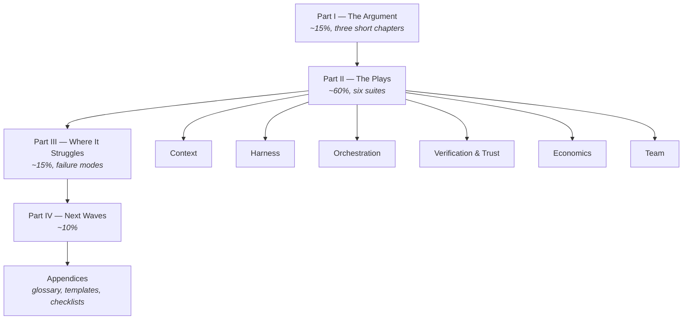
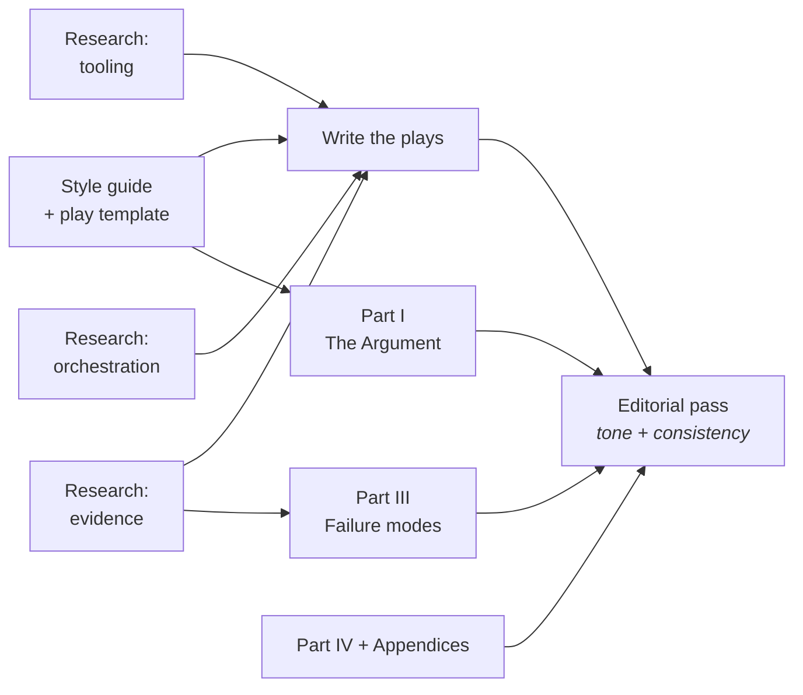

# The Agentic Playbook — Build Plan

This is the authoritative planning document. The original scattered ideation now lives in
[`notes/raw/`](notes/raw/) as source material and should not be edited further.

---

## 1. Decisions

| Question | Decision |
|---|---|
| **Deliverable** | A markdown book in this repo — chapters as files, readable on GitHub, optionally rendered as a static site later. |
| **Primary reader** | Working developers already using Claude Code / Copilot daily, who want to get *good* at it. Not a sales pitch, not a manager's guide. |
| **Tone** | Dry and wry. Straight-faced technical prose with sharp asides. Humour lives in the framing and the examples, never in the instructions. |
| **Structure** | Plays-first. Framing is compressed to ~15%; the bulk of the book is named, self-contained plays. |

### On the tone, specifically

The register is "experienced colleague who has been burned and finds it funny in retrospect."
Concretely:

- **Yes:** a section called *Starve the Context* that opens by noting most context windows are
  filled the way a suitcase is packed the night before a flight.
- **Yes:** failure modes given names and treated as recurring characters.
- **No:** jokes inside a numbered procedure. When the reader is copying a command at 16:50 on a
  Friday, the prose gets out of the way.
- **No:** exclamation marks, emoji-as-punchline, or "AI will take your job (just kidding… unless?)".

The existing ideation is written completely straight — plot-2 reads like a conference abstract.
The tone shift is deliberate and applies to new prose only.

---

## 2. Why this structure

`notes/raw/outline-and-critique.md` contains a chapter outline **and** a critique of that outline.
The critique's verdict was that the outline was "a taxonomy rather than a playbook," and that
"a book called *Playbook* should be roughly half plays." This plan takes that seriously rather
than patching around it.

The three ideas worth keeping from the original outline:

1. **The historical analogy** — source control before Git, process before Scrum, agentic work now.
   The critique called this the strongest idea in the book. It survives, as the argument that
   opens the book.
2. **The Four Areas** — Computer Science, Software Engineering, Craftsmanship, Innovation. A
   durable mental map that outlives whichever tool is fashionable. It survives, re-weighted.
3. **The thesis** — the engineering layer is genuinely unsettled, and teams have to build it
   themselves. This is the reason the book exists.

What changes: those three stop being *chapters* and become the short argument that justifies the
plays. Everything else earns its place by being immediately usable.

---

## 3. Book structure

### Part I — The Argument (short)

1. **Before Git, Before Scrum, Before This** — the historical analogy, told once, well.
2. **The Four Areas, Re-weighted** — what a developer still needs to know, and what has quietly
   stopped mattering as much.
3. **What This Book Assumes About You** — the stated-reader box the critique asked for.

### Part II — The Plays (the bulk of the book)

Every play follows the same template, so the book is skimmable under deadline:

> **Problem** — one paragraph, no preamble.
> **The play** — what to actually do.
> **Worked example** — real files, real commands, real output.
> **Failure mode** — how this goes wrong, named and described.
> **Checklist** — the skimmable version for someone who has read it once already.

Tools appear *inside* plays as examples, never as headings. This is deliberate: product names age
fastest, and a chapter called "LangChain" is a chapter with a shelf life.

| Suite | Plays (working titles) | Tools that appear as examples |
|---|---|---|
| **Context** | Write the brief the agent actually reads · Starve the context · Scope a task to fit the window | `CLAUDE.md`, `AGENTS.md`, `rtk` |
| **Harness** | Choose your harness · Package repeatable expertise · Wire in the outside world | Skills, MCP servers, permissions/sandboxing |
| **Orchestration** | Decompose into subagents · Make the control flow deterministic · Work in parallel without collisions | subagents, LangGraph, n8n, git worktrees |
| **Verification & Trust** | Review code you did not write · Make the agent prove it · Decide who signs off | test strategy, review practice, accountability |
| **Economics** | Understand what you are paying for · Match the model to the job · Know when not to use an agent | token accounting, model tiering |
| **Team** | Build the working agreement · Collect and refine as a team · Onboard someone into all this | shared skill libraries, team conventions |

Note the four suites that were **entirely missing** from the original outline and are recovered
here: context engineering, harnesses and tool-calling (named in `idea.md`, absent from the
outline), verification, and cost. The critique flagged all four.

### Part III — Where It Struggles

The original outline gave this one bullet. It gets real space, because credibility depends on it:
the tasks agents are reliably bad at, the failure modes worth recognising on sight, and the honest
accounting of where the time actually goes.

### Part IV — Next Waves

The three-wave roadmap from `idea.md`, preserved: refactoring projects for agent-first
development, then inviting designers and non-coders in as co-pilots.

### Appendices

Glossary, per-suite team checklists, copy-paste templates (`CLAUDE.md` starter, working-agreement
skeleton, review checklist), further reading.

---

## 4. Research required

The book makes claims. Three research passes gather the evidence before the writing starts, so the
chapters cite reality rather than vibes:

- **Tooling landscape** — current conventions for agent context files, Skills, and MCP; what is
  standardised vs. what is one vendor's habit.
- **Orchestration landscape** — subagent patterns, LangChain/LangGraph/n8n, where deterministic
  workflows genuinely beat a single capable agent.
- **Evidence and economics** — published studies on agent-assisted productivity and code quality,
  documented failure modes, token pricing and model-tiering math.

Research output goes to `notes/research/` as cited briefs, not prose. Writers draw from it.

---

## 5. Build sequence

The style guide and play template come first and block all writing — with multiple authors and a
specific comic register, "we'll harmonise it later" is how a book ends up with three voices and a
tone that lurches. The editorial pass at the end exists to enforce exactly one.

Board items for each stage are filed under the **Agentic Playbook** epic.

Execution state — milestone status, the append-only decision log, the current handoff note, and
the open questions — lives in [`plans/agentic-playbook.md`](plans/agentic-playbook.md). This
document holds the design and the reasoning; that one holds where the work stands. Read both
before starting a task; update that one when you finish.
