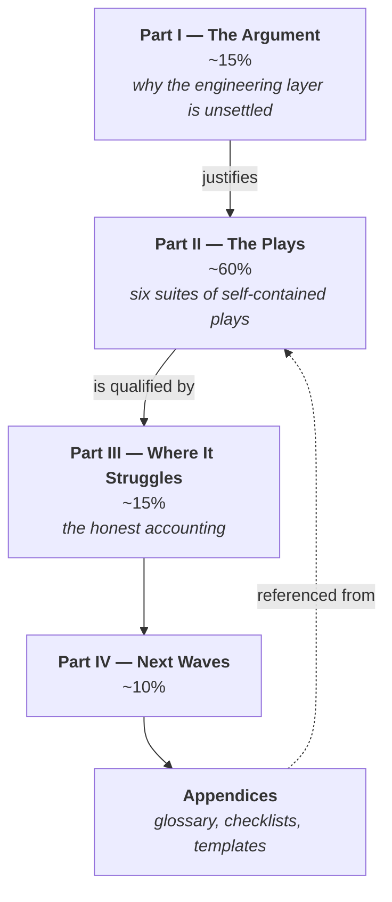

# The Agentic Playbook — the book

This directory is the deliverable: a markdown book, readable on GitHub, for working developers who
already use agentic coding tools daily and want to get good at them. The design behind it is in
[`PLAN.md`](../PLAN.md); execution state and the handoff note are in
[`plans/agentic-playbook.md`](../plans/agentic-playbook.md).

This file covers where files go, what they are called, what order they are in, and how they link to
each other. Voice and formatting are in [`STYLE.md`](STYLE.md); the shape of a play is in
[`TEMPLATE-play.md`](TEMPLATE-play.md).

## Before you write anything

1. [`STYLE.md`](STYLE.md) — the register, the bans, four samples to pattern-match against.
2. [`TEMPLATE-play.md`](TEMPLATE-play.md) — the five-heading contract and a fully written specimen
   play. Only if you are writing a play.
3. [`cards/book-structure.md`](../cards/book-structure.md) — the proportions, which are the point of
   the book rather than a guideline.
4. [`plans/agentic-playbook.md`](../plans/agentic-playbook.md) — the running log, including names
   other authors have already coined for failure modes.

## How the parts fit



Part I earns the reader's attention and is then out of the way. Part II is what the book is for: a
reader opens it at one play, acts on it that afternoon, and never reads the surrounding pages. Part
III is what makes Part II credible. Part IV is the only speculative material in the book and is
labelled as such.

## Directory layout

Directories are created by the first task that needs one. Do not add `.gitkeep` files or placeholder
chapters to reserve space — an empty directory is not a promise anyone can read.

| Path | Holds | Created by |
|---|---|---|
| `README.md` | This file: layout, ordering, cross-references, the table of contents. | done |
| `STYLE.md` | Voice, register, bans, formatting mechanics. | done |
| `TEMPLATE-play.md` | The play contract plus one specimen play. | done |
| `part-1-argument/` | Three short chapters. | Part I task |
| `part-2-plays/<suite>/` | One directory per suite; `index.md` plus one file per play. | each suite task |
| `part-3-where-it-struggles/` | Failure modes, tasks agents are bad at, where the time goes. | Part III task |
| `part-4-next-waves/` | The three-wave roadmap. | Part IV task |
| `appendices/` | Glossary, per-suite team checklists, copy-paste templates, further reading. | appendices task |
| `examples/` | Scratch projects the worked examples were captured from. Not book content. | verification pass |

The six suite directories are `context/`, `harness/`, `orchestration/`, `verification-and-trust/`,
`economics/`, and `team/`, all under `part-2-plays/`.

**Part directories are numbered; files are not.** Part order is locked in `PLAN.md` and will not
change, so the number is free information in the path. Files inside a part get reordered, inserted,
and dropped throughout the writing, and renumbering a directory is a merge conflict waiting to
happen.

## File naming

- Lowercase, hyphenated, `.md`.
- Named for content, never for position: `starve-the-context.md`, not `play-03.md`.
- A play's filename is its title, lowercased and hyphenated, with articles kept: *Review code you
  did not write* → `review-code-you-did-not-write.md`.
- A suite's opener is `index.md` in the suite directory. Not `README.md` — GitHub would render it
  automatically in the directory view, which is convenient but makes book content look like repo
  documentation.

## Suite openers

Each of the six suites opens with `index.md`, and it has one job beyond introducing the files under
it: **name the single idea the suite is an application of, then show each play as that idea at a
different layer.** The Context suite's opener names *signal over noise* and presents its four plays
as that one move applied to what the always-loaded layer says, to how it is arranged, to a single
run, and to the task itself.

The opener is where a unifying principle belongs. It is not a fourth play: as a noun phrase it fails
the imperative-title rule in [`TEMPLATE-play.md`](TEMPLATE-play.md#title), and rewritten as an
imperative it collapses into whichever play sits nearest it. Stated in the opener it costs forty
words. Stated as a play it costs a slot and overlaps its neighbour.

An opener contains, in order:

1. A paragraph of framing that puts the reader in the suite's situation. Humour is allowed here — it
   is one of the few places it is. See [`STYLE.md`](STYLE.md#where-humour-is-allowed).
2. The suite's one idea, named in a sentence, in words a reader could repeat.
3. One short paragraph per play, linking to it and saying which layer or case it covers.

150–300 words, per [`STYLE.md`](STYLE.md#length). Do not re-establish why any of this matters — Part
I did that, and a suite opener that re-argues it is the fastest way for Part II to lose the space
the plays were given.

## Ordering

**The table of contents below is the only thing that encodes order.** Not filenames, not directory
listings, not the sequence in which files were committed.

When you add a file, add its row in the same commit. A file that is not in the table of contents is
not in the book, and the editorial pass will treat it as an orphan.

That is now enforceable rather than merely agreed: the build reads this table to decide what to
collect, so an untabled file is absent from every build. Run `make check` to be told — it reports
orphans, rows whose file is missing, and headings that disagree with their title here. See
[`cards/building-the-book.md`](../cards/building-the-book.md).

### Table of contents

Status: ⬜ not written · 🟡 in progress · ✅ done.

| # | Path | Title | Status |
|---|---|---|---|
| **Front matter** | | | |
| 0 | `preface.md` | Preface | ✅ |
| **Part I** | | **The Argument** | |
| 1 | `part-1-argument/before-git-before-scrum-before-this.md` | Before Git, before Scrum, before this | ✅ |
| 2 | `part-1-argument/the-four-areas-reweighted.md` | The four areas, re-weighted | ✅ |
| 3 | `part-1-argument/what-this-book-assumes-about-you.md` | What this book assumes about you | ✅ |
| **Part II** | | **The Plays** | |
| 4 | `part-2-plays/context/index.md` | Context | ✅ |
| 5 | `part-2-plays/context/write-the-agent-file-that-actually-gets-read.md` | Write the agent file that actually gets read | ✅ |
| 6 | `part-2-plays/context/split-the-agent-file-into-cards.md` | Split the agent file into cards | ✅ |
| 7 | `part-2-plays/context/starve-the-context.md` | Starve the context | ✅ |
| 8 | `part-2-plays/context/scope-a-task-to-fit-the-window.md` | Scope a task to fit the window | ✅ |
| 9 | `part-2-plays/harness/index.md` | Harness | ✅ |
| 10 | `part-2-plays/harness/choose-your-harness.md` | Choose your harness | ✅ |
| 11 | `part-2-plays/harness/package-repeatable-expertise.md` | Package repeatable expertise | ✅ |
| 12 | `part-2-plays/harness/wire-in-the-outside-world.md` | Wire in the outside world | ✅ |
| 13 | `part-2-plays/orchestration/index.md` | Orchestration | ✅ |
| 14 | `part-2-plays/orchestration/decompose-into-subagents.md` | Decompose into subagents | ✅ |
| 15 | `part-2-plays/orchestration/make-the-control-flow-deterministic.md` | Make the control flow deterministic | ✅ |
| 16 | `part-2-plays/orchestration/work-in-parallel-without-collisions.md` | Work in parallel without collisions | ✅ |
| 17 | `part-2-plays/verification-and-trust/index.md` | Verification and trust | ✅ |
| 18 | `part-2-plays/verification-and-trust/review-code-you-did-not-write.md` | Review code you did not write | ✅ |
| 19 | `part-2-plays/verification-and-trust/make-the-agent-prove-it.md` | Make the agent prove it | ✅ |
| 20 | `part-2-plays/verification-and-trust/decide-who-signs-off.md` | Decide who signs off | ✅ |
| 21 | `part-2-plays/economics/index.md` | Economics | ✅ |
| 22 | `part-2-plays/economics/understand-what-you-are-paying-for.md` | Understand what you are paying for | ✅ |
| 23 | `part-2-plays/economics/match-the-model-to-the-job.md` | Match the model to the job | ✅ |
| 24 | `part-2-plays/economics/know-when-not-to-use-an-agent.md` | Know when not to use an agent | ✅ |
| 25 | `part-2-plays/team/index.md` | Team | ✅ |
| 26 | `part-2-plays/team/build-the-working-agreement.md` | Build the working agreement | ✅ |
| 27 | `part-2-plays/team/settle-what-the-team-cannot-agree.md` | Settle what the team cannot agree | ✅ |
| 28 | `part-2-plays/team/collect-and-refine-as-a-team.md` | Collect and refine as a team | ✅ |
| 29 | `part-2-plays/team/onboard-someone-into-all-this.md` | Onboard someone into all this | ✅ |
| **Part III** | | **Where It Struggles** | |
| 30 | `part-3-where-it-struggles/what-agents-are-reliably-bad-at.md` | What agents are reliably bad at | ✅ |
| 31 | `part-3-where-it-struggles/the-failure-modes-worth-naming.md` | The failure modes worth naming | ✅ |
| 32 | `part-3-where-it-struggles/where-the-time-actually-goes.md` | Where the time actually goes | ✅ |
| 33 | `part-3-where-it-struggles/what-is-genuinely-contested.md` | What is genuinely contested | ✅ |
| **Part IV** | | **Next Waves** | |
| 34 | `part-4-next-waves/the-three-waves.md` | The three waves | ✅ |
| 35 | `part-4-next-waves/refactoring-a-codebase-for-agents.md` | Refactoring a codebase for agents | ✅ |
| 36 | `part-4-next-waves/inviting-non-developers-in.md` | Inviting non-developers in | ✅ |
| **Appendices** | | | |
| 37 | `appendices/glossary.md` | Glossary | ✅ |
| 38 | `appendices/team-checklists.md` | Team checklists | ✅ |
| 39 | `appendices/copy-paste-templates.md` | Copy-paste templates | ✅ |
| 40 | `appendices/further-reading.md` | Further reading | ✅ |

Titles here are the working titles from `PLAN.md`. Sharpening one is fine and expected — change the
title, the filename, and this row together, and note it in the running log so anyone linking to it
finds out.

Play counts per suite are settled in
[`plans/agentic-playbook.md`](../plans/agentic-playbook.md#open-questions): three is a floor rather
than a ceiling, and the Context suite runs to four. The procedure did not change with the answer.
Adding a play to a suite is still a decision worth raising rather than making quietly, because Part
II's balance is visible to the reader; adding a seventh *suite* is a change to `PLAN.md`.

## Worked-example scratch projects

[`examples/`](examples/) holds the projects the book's captured output actually came out of, one
directory per project, each with a `reproduce.py` that builds a throwaway copy, runs the exact
commands the book prints, and echoes what comes back. `atlas` and `cards` back the Context suite,
`meridian` the Orchestration suite, `tideline` the Verification and Trust suite, and `session-cost`
re-derives the Economics suite's cost table from its inputs. `cards` is the one that is not
fictional: that play's example is this repository's own setup, so the script copies the real
`CLAUDE.md` and `cards/` out of the checkout.
[`examples/README.md`](examples/README.md) is the index, and it also lists the examples that are
deliberately *not* reproduced and why.

These are apparatus, not chapters. They have no table-of-contents rows, the build never collects
them, and `make check` does not report them as orphans.

**If you change a worked example that prints captured output, re-run its project.** The scripts
assert the shapes the prose depends on — how many files changed, how many call sites there are —
and exit non-zero when the book and the tree have drifted apart. That is the whole reason they are
committed rather than thrown away after the capture.

## Cross-references

Chapters and plays link to each other constantly — that is what makes a self-contained play
self-contained. The rules exist so the links survive files being renamed and rewritten by people who
are not in the room.

**Use relative paths from the linking file, and italicise the title:**

```markdown
See [*Starve the context*](../context/starve-the-context.md).
```

**Prefer file-level links.** Deep-link to a heading only when it is one of the five template
headings, which are guaranteed stable by [`TEMPLATE-play.md`](TEMPLATE-play.md):

```markdown
[*Starve the context*](../context/starve-the-context.md#failure-mode)
```

Never anchor to an `###` subsection. Those belong to the play's author and can change under you
without anyone noticing the link rotted. Anchors follow GitHub's slug rules: lowercase, spaces to
hyphens, punctuation dropped.

**Never reference by position.** No "see chapter 4", no "as we saw earlier", no "in the next
section". The table of contents is the only ordering, and a reader who opened the book at one play
has not seen anything earlier.

**Linking to a file that does not exist yet is allowed** if its path is in the table of contents
above. Nine writing tasks run in parallel; forbidding forward references would mean nobody could
cross-reference anything. The link resolves when the file lands, and the editorial pass sweeps for
paths that never did.

**Evidence:** cite research notes in [`notes/research/`](../notes/research/) with relative links.
Never link into `notes/raw/` — it is frozen provenance, not a source the book stands on.

**External links:** inline, full URL, no shorteners. Name the document as well as linking it, so the
reference still means something after the vendor reorganises their docs.

## Adding a file

- [ ] It is in the right part directory, named for its content
- [ ] It has one `#` heading matching its table-of-contents title
- [ ] If it is a play, it has the five template headings, verbatim and in order
- [ ] If it is a play, it states its exchange rate — what the reader gives up — somewhere in *The
      play*, because Part I promises the reader that it will
- [ ] If it is a suite opener, it names the suite's one idea and frames each play as an application
      of it
- [ ] Its worked example re-introduces the suite's project in a clause, and refers back to no other
      play
- [ ] Its row is added to the table of contents in the same commit
- [ ] Any command output it prints is either captured, with the `> Captured …` line above the
      fence, or written so it could not be mistaken for a transcript
- [ ] If it changes a captured example, that example's `reproduce.py` has been re-run and still
      exits zero
- [ ] Prose wraps at 100 columns; diagrams are mermaid
- [ ] Any failure mode it names is appended to the running log in `plans/agentic-playbook.md`
- [ ] Any decision it made that affects other authors is in that plan's decision log
- [ ] `make check` reports no problems, and no note against a file you touched. It runs the style
      checker too, so it is also what decides the column limit, the whitespace rules, the language
      tag on every fence, the outright bans and the word budgets — do not count columns or words
      by hand, and do not write a script that does
