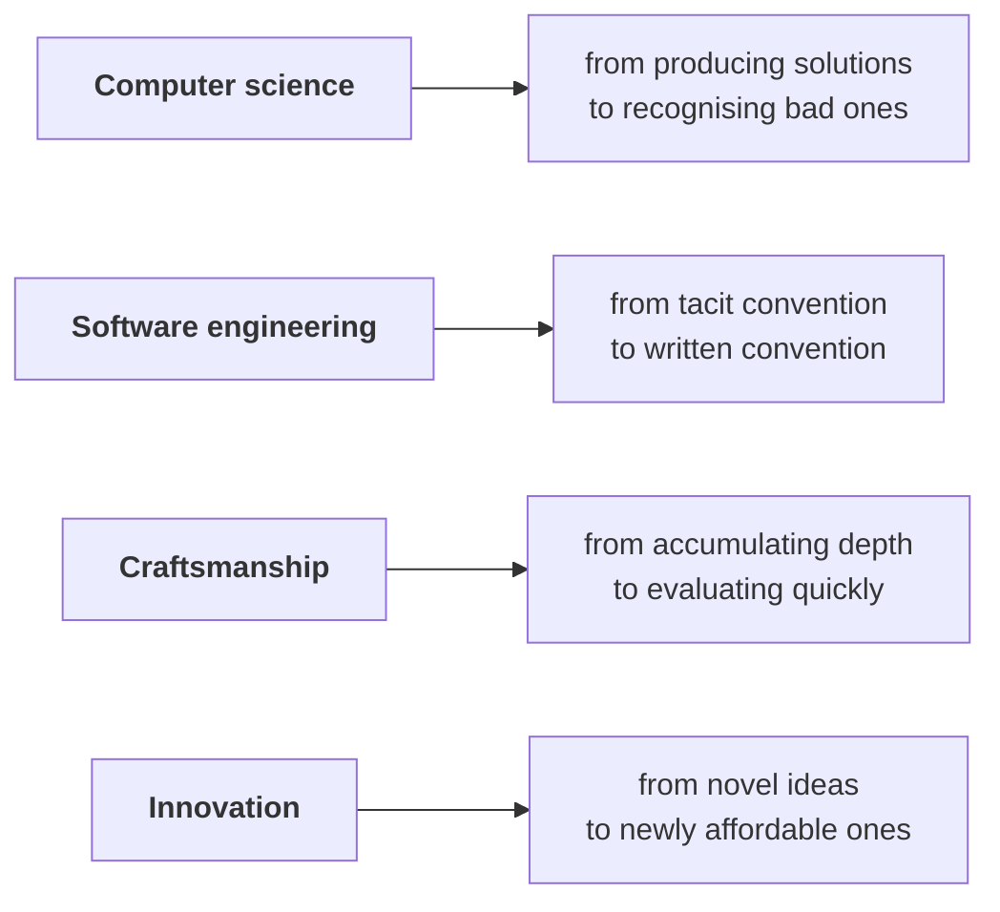

# The four areas, re-weighted

This book treats a developer's work as four things happening at once. *Computer
science*: what you know about the machine and about what runs on it. *Software engineering*: the
things done in order to work together. *Craftsmanship*: personal facility with your tools.
*Innovation*: the creative part, where a problem gets solved that was not being solved.

It is a crude map, which is why it survives. Nothing in it names a language, a framework, a vendor,
or a decade. That makes it the right instrument while tooling turns over faster than opinions about
it: it lets you ask of any change which of the four it actually moved. Most claimed revolutions move
exactly one, and announce that they moved all four.

Agentic tools move all four, unevenly, and mostly not in the direction the marketing suggests.

## Computer science: recall gets cheap, recognition does not

The loose version of this claim is that agentic tools mean you need less computer science. The
defensible version is narrower, and the loose one is what gets quoted at people making hiring
decisions.

Production is cheap now. You will not often write a binary search over a rotated array from memory
again, or derive the recurrence for a merge sort at a whiteboard that is not part of an interview.
That recall was a genuine cost and it has largely gone.

Recognition has not gone, and has arguably got more expensive. Noticing that the loop the agent
wrote is quadratic and sits inside a request handler. Noticing that the query it produced is correct
and does a full table scan on the one table that grows without bound. Knowing which of two correct
implementations is the one that pages somebody at 03:00. The agent will hand you a plausible
implementation faster than you can evaluate it, which moves the bottleneck squarely onto the half of
computer science that interviews never tested.

Recognition has historically been acquired through production. You learned to see an accidentally
quadratic loop by writing a few and being made to care about the consequences. If the production
step is removed for an entire cohort, the acquisition path for the judgement goes with it, and
nobody has a convincing account of what replaces it. This book cannot fix that. It can decline to
pretend the trade is free.

The other half of the re-weighting is breadth, across technologies rather than into algorithms. An
agent will pick a library, and it will pick a plausible one. Whether that library is maintained,
whether its licence is compatible with your product, whether it drags in a transitive dependency
your security team has an opinion about, whether your codebase already depends on two libraries that
do the same thing — none of that is in the model's reward function, and all of it is in your
afternoon. Knowing the shape of the technology landscape got more valuable, not less.

## Software engineering: the area that grew

The intuitive read is that if the agent writes the code, the coordination overhead falls. The
opposite happened, and it is the reason most of this book is about this one area.

You have added contributors to your codebase who do not attend the stand-up, do not read the
channel, do not absorb what was decided in a corridor on Thursday, and inherit only what is written
down. Every convention your team holds tacitly is now either written or absent.

That turns a great deal of what used to be optional documentation into something with teeth. An
undocumented convention is no longer a mild debt somebody will get to. It is a defect that gets
reproduced at scale, in parallel, by something that works faster than you do and has no opinion
about whether the convention was any good.

The other growth is in review. Writing got cheaper; checking did not. DORA's term for the time
developers spend checking agent output is the *verification tax*, and this book uses it throughout.
The full accounting is in [*Where the time actually
goes*](../part-3-where-it-struggles/where-the-time-actually-goes.md), with the evidence in
[`notes/research/evidence.md`](../../notes/research/evidence.md). Review was already the scarcest
resource on most teams. It is now being asked to cover more diff per week, produced by something
that does not slow down.

Written convention also changes the shape of the working day. One way of working assembles context
in the conversation: here is the project, now the module, now how this codebase handles errors, and
— five prompts in — the actual task. It works, and none of it survives the session, so tomorrow you
pay for it again.

The alternative splits the work into two modes. *Preparation* is everything that makes the project
legible without you in the room — the agent file, the *cards* (short files, one subject each, loaded
when that subject comes up), the conventions written down, the checks a change has to pass.
*Execution* is handing a prepared project a task and reading what comes back: closer to a rocket
launch than to a conversation, and nothing gets explained on the pad. The agent is useful in both:
it can draft and keep current much of the preparation material itself.

Most of Part II is preparation-mode work: things to do on a quiet afternoon, against a problem you
do not have yet, and cashed in on a busy day.

## Craftsmanship: from accumulation to evaluation

Craftsmanship in the original framing is the personal trait: you know your tools the way a joiner
knows theirs. Historically this rewarded accumulation. Twelve years of vim. An editor configuration
shaped to one person over a decade. Depth paid because the tools held still long enough for depth to
compound.

The relevant toolset has turned over, and it now turns over on a cadence measured in months. Deep
investment in one specific tool has a worse return than it used to, and the thing that was
previously a nice-to-have has become the actual skill: being able to tell, inside an afternoon,
whether a new tool changes your day.

That is learnable, and it is not the same thing as enthusiasm. In practice it looks like keeping one
real task you always run first against anything new, because you know exactly what good looks like
on it. Knowing which of your current frictions are structural and which are merely current. Being
willing to discard a setup you spent a week building.

The cost is real. The accumulated investment is not recoverable, and the people most likely to get
stuck are the ones best at the old tools, because they have the most to give up and the most
evidence that their way works. That is not a character flaw; it is what a sunk cost feels like from
the inside.

## Innovation: the price of the boring thing changed

The re-weighting here is the least discussed of the four and possibly the most useful.

The change is not mainly that hard problems became easy. It is that one specific category of work
became cheap: the things that were always worth doing and never worth doing *now*. The mechanical
migration across forty files. The test suite for the legacy module nobody owns. The internal tool
that would save six people ten minutes a day and was never worth a week of anybody's time. None of
these were hard. They were expensive, and the price moved.

So part of what innovation means now is a scanning skill: recognising which items on the
worth-doing-but-never-now list have quietly become affordable. That is a different capability from
having a novel idea, it is more teachable, and on most teams it pays sooner.

One caveat belongs here rather than later, because leaving it out is how this argument becomes a
sales pitch. Cheap to produce is not cheap to review. A forty-file migration generated in an hour
still has to be checked by a person, and the checking did not get an hour cheaper. The category that
genuinely opened up is the one where verification is also cheap — where a test suite, a type
checker, a linter, or a replay of production traffic can carry most of the load. Where verification
stays expensive and human, the price barely moved at all.

## Using the map

The map is a diagnostic to run on claims, including this book's. When the next tool arrives — and it
will arrive before this book is old — the useful question is not whether it is impressive. It is
which of the four it moves. A tool that only moves craftsmanship is a personal preference and can be
adopted by one developer on a Tuesday afternoon without telling anyone. A tool that moves software
engineering changes how a team works and needs an agreement before it needs a licence. A tool that
claims to take computer science off your hands is claiming your judgement is no longer load-bearing,
which is a claim worth testing carefully and in a branch.

Agentic tools do move all four, mostly towards more judgement rather than less. A tool that claims
to move all four in the flattering direction is making a sales pitch, and you have heard a number of
those this year.
