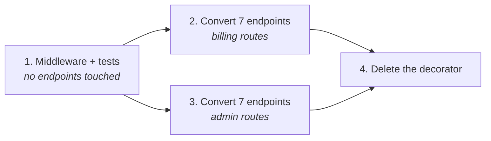

# Scope a task to fit the window

## Problem

You hand over the auth migration — fourteen endpoints, one decorator to retire — and forty minutes
later it is still going. The first six endpoints look good. Somewhere around the ninth it starts
re-implementing a helper it wrote at minute twelve, and the tenth uses an error shape that
contradicts the third. Nothing errors, nothing stops, and every time you look it appears to be one
step from finished, so you type "continue" for the third time. What you end up reviewing is not a
change. It is the sediment of four runs, and separating them costs more than the change was worth.

## The play

Size the unit of work by what has to be held in mind at once, not by how many lines it touches.

1. **Split at the first boundary where the agent would need both halves at the same time.** In
   practice that is a module edge or a change of data format: the migration script and the code that
   reads the new format are two tasks. Write the boundary into the task brief for each half, so the
   second task does not re-derive it and disagree.
2. **Scope by capability, not by layer.** "Add validation to the checkout endpoint, its schema, and
   its tests" is one unit; "add validation to every schema in the repo" is a sweep that will drift
   by the eighth file. An agent's unit of work is a behaviour, not a directory. Where a layer-first
   layout makes that split awkward — one capability living in six files across three trees — the
   difficulty is in the repository, not the task: see [*Refactoring a codebase for
   agents*](../../part-4-next-waves/refactoring-a-codebase-for-agents.md).
3. **Hand the requirements over as an external list, not as prose to remember.** A numbered list of
   acceptance conditions in a file the agent can re-read beats the same conditions buried in your
   opening message. In the one white-box study of this
   ([`failure-modes.md`](../../../notes/research/failure-modes.md), arXiv 2607.17937, August 2026),
   a large-context task that succeeded 3 times in 10 succeeded 10 times in 10 when the requirements
   were supplied as an external list; a generic "check your work" prompt got 5.
4. **Stop on the tells, not on the error.** Three tells, any one of which means re-scope rather than
   continue: the agent re-implements something already present in its own diff; an edit contradicts
   an earlier edit from the same run; you have said "continue" more than twice.
5. **Hand off state in a file, not in the conversation.** Before a session ends, have the agent
   write what was done, what is next, which decisions were made and why, and what must not be
   redone. The next session inherits the written handoff and none of the chat, so a convention
   you established by typing it is gone.
6. **Start the next unit from that file and a clean tree**, rather than from a continued session.

Fitting in the window is necessary and nowhere near sufficient. In the same study the agent's
coverage of the requirements barely moved as the context grew, while the rate at which it satisfied
all of them at once collapsed — the failure this book calls the Requirement It Can Still Quote,
measured in [*The failure modes worth
naming*](../../part-3-where-it-struggles/the-failure-modes-worth-naming.md). The question is not
"will it fit" but "can it still satisfy all of this at once", so the answer is a smaller task rather
than a bigger window. The exchange rate: four task briefs instead of one, four sets of results to
read, and a boundary you might place wrong, against the ability to re-run a quarter of the work
instead of all of it.

## Worked example

`atlas`, the Python billing service, retiring a bespoke `@requires_auth` decorator in favour of
middleware across fourteen endpoints.

The first attempt was one task. It produced the forty-minute run in *Problem*: endpoints one to six
converted cleanly, seven to fourteen drifting, and a diff too tangled to accept in parts. It was
discarded, at a cost of one run.

The second attempt split at the boundary where both halves would be needed at once — the middleware
had to exist and be settled before any endpoint could be moved onto it:



Each unit got an external requirement list, checked in so both the agent and the reviewer read the
same one:

```markdown
# Unit 2 — convert billing routes

- [ ] Every route in `atlas/billing/routes.py` uses `AuthMiddleware`
- [ ] No route retains `@requires_auth`
- [ ] 401 responses keep the existing body shape: `{"error": {"code", "message"}}`
- [ ] `pytest tests/billing -q` passes
- [ ] No file outside `atlas/billing/` is modified
```

Unit 2 came back wrong in one respect, and it was the interesting one. Unit 1 had decided to raise
`AuthError` and let the middleware map it to a 401; unit 2, which never saw that conversation, went
with returning a response directly from the middleware. Both are defensible; having both is not. The
decision had been made in chat and therefore did not exist. It went into the handoff file as one
line — "auth failures raise `AuthError`; only the middleware serialises it" — and unit 2 was re-run
against it. Re-running one of four units is a cheap correction, and it was cheap precisely because
it was one of four.

## Failure mode

**The Permanent Near Miss.** The run does not fail. It ends just short — one endpoint unconverted,
one test still red, one loose end that looks like one more minute of work — so you continue it, and
the continuation also ends just short. The work is genuinely progressing and genuinely never
arriving, and because each individual turn looks like the last one needed, there is no moment that
presents itself as the moment to stop. It is the dominant outcome on long-horizon benchmarks — near
misses outnumber passes, and most unresolved runs end on a time budget rather than on anything
breaking, which is measured in [*What agents are reliably bad
at*](../../part-3-where-it-struggles/what-agents-are-reliably-bad-at.md). The tell is that your
estimate of "nearly done" has not moved in twenty minutes while the diff has. The second tell is
reaching for "continue" instead of reading what you already have.

## Checklist

- [ ] The task has one boundary-free unit of work, not several joined by "and then"
- [ ] The split point is where both halves would otherwise be needed at once
- [ ] Acceptance conditions exist as a list in a file, not only in the opening message
- [ ] A stop rule is agreed before the run: re-implementation, self-contradiction, or a third
      "continue"
- [ ] State for the next session is written to a file, including decisions made in chat
- [ ] The next unit starts from that file and a clean tree, not from a continued session

**See also:** [*Starve the context*](starve-the-context.md) ·
[*Decompose into subagents*](../orchestration/decompose-into-subagents.md) ·
[*Make the control flow deterministic*](../orchestration/make-the-control-flow-deterministic.md)
for the same split repeated across many items
