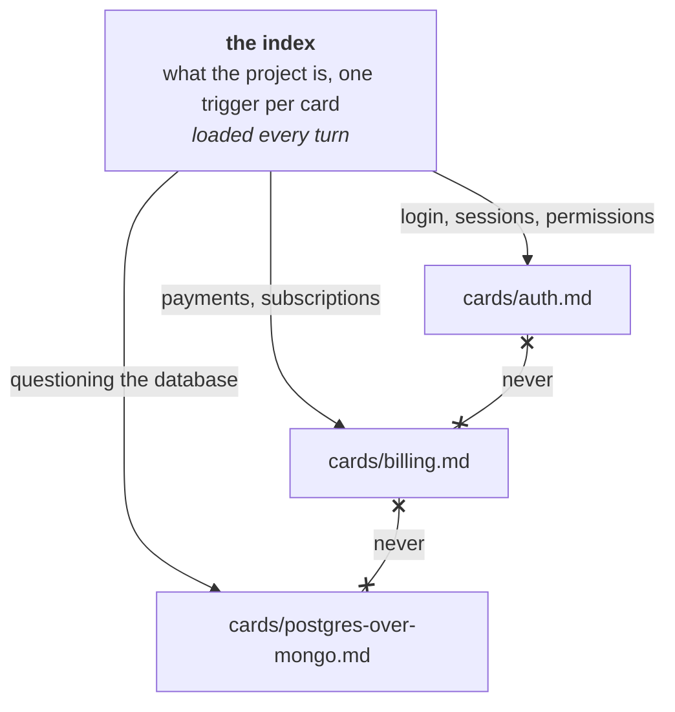

# Split the agent file into cards

## Problem

You did the pruning. The four-hundred-line agent file is thirty lines now, and the forty lines on
the migration workflow, the release runbook, and the note explaining why the search index is
denormalised have gone to `docs/`, where they are correct, current, and read by nobody. The agent
works from the thirty lines and its own guesses, so the migration advice arrives in code review
instead — from you, retyped, in the words you deleted last month. Moving the material out was right.
Nothing brought it back, and a prune with no return path is a deletion with a longer audit trail.

## The play

Two tiers: an index that loads every turn, and files that load when the index says they apply.

1. **Make the index the only thing that loads unconditionally.** Two or three sentences on what the
   project is and is not, then one line per *card*: a markdown file on one subject, with a heading,
   a one-line summary, and a body. No frontmatter, no schema, no required fields. Every line of the
   index is paid for in every session, so it is the only tier whose size compounds.
2. **Write each entry as a trigger, not as a title.** Name the situation that should send the agent
   to the file, in the words a request would arrive in. A title leaves the agent to work out whether
   the file matters now; a trigger has already decided.

   ```markdown
   - [auth](cards/auth.md) — when touching login, sessions, or permissions
   ```
3. **One card, one load, no chains.** A card never requires another card. Where two need the same
   paragraph, hoist it into a third card and index that, or repeat it: a duplicated paragraph costs
   a few dozen tokens, a chain costs the property the arrangement is built on. A link a reader may
   follow is not a chain; a sentence that cannot be acted on without the other file is.
4. **Put the reason next to the rule.** The body is prose because no schema has a field for why the
   database is Postgres, and the reason is what makes the card deletable next year by somebody who
   was not there.
5. **Let the kinds stay informal.** Most cards are a domain, a feature, or a decision — a slice of
   the system, one capability, or why this and not that. Useful for noticing a card trying to be
   two, not a taxonomy to declare.
6. **Prune the index rather than the cards.** When the agent gets something wrong that a card
   covers, the trigger failed to match; rewrite the trigger before touching the card. An entry
   nothing has ever matched is a card nobody needs, or a trigger written in the author's vocabulary
   rather than the requester's.



Splitting an agent file into `@path` imports is not this move: imports expand at launch and change
nothing, while the saving here is a file going unread. Three mechanisms now do conditional loading
and differ mainly in who decides. A path-scoped rule fires when a matching file is opened, so the
filesystem decides. A skill fires when the harness matches a request against a description
([*Package repeatable expertise*](../harness/package-repeatable-expertise.md)). A card fires when
the model reads one line of prose and judges that it applies. The card is the weakest of the three
and the only one whose trigger can carry a reason. That is the exchange rate: the match is a
judgement rather than a rule, so a card will sometimes not load when it should — the same silent
non-event as the Unsummoned Skill — in return for a mechanism you can write in a sentence and change
in a minute.

## Worked example

This book's own repository, which has no application code in it: thirty-nine markdown chapters, the
research notes behind them, and a build script. It was written by agents working in parallel on
separate board items, each starting from an empty context window with no memory of the last, which
makes the always-loaded tier the only thing every author was guaranteed to have read.

The alternative was one file holding every convention the repo has — the column limit, where
research notes go, what shape a play takes, how the PDF is rendered, which directories are frozen.
That was declined early, on the grounds that a task writing a chapter would pay for the build
instructions in every turn. What loads instead is the index:

```markdown
## Context cards

Load a card when its situation matches. Each one stands alone.

- [repo-layout](cards/repo-layout.md) — creating a file and unsure where it belongs, looking for
  existing material, or about to edit something in `notes/raw/` or `PLAN.md`
- [book-structure](cards/book-structure.md) — writing or editing any part of the book itself:
  which part it belongs to, how long it should be, what shape a play takes
…
```

Five entries in that shape, and nothing else that loads unconditionally. The two tiers, measured:

> Captured September 2026, BSD `wc` on macOS 26.4.

```bash
$ wc -l CLAUDE.md cards/*.md
      60 CLAUDE.md
      70 cards/book-structure.md
     286 cards/building-the-book.md
      64 cards/repo-layout.md
      65 cards/research-notes.md
      76 cards/standing-defaults.md
     621 total
```

Roughly a tenth of the written conventions load unconditionally. The rest arrive when a trigger
matches, which for most tasks is one card.

Self-containment is the rule with nothing enforcing it: a link from one card to another is an
ordinary markdown link, and no tool objects. So it was audited by hand.

> Captured September 2026, BSD grep 2.6.0-FreeBSD on macOS 26.4.

```bash
$ grep -oE '\]\([a-z-]+\.md\)' cards/*.md
cards/building-the-book.md:](standing-defaults.md)
cards/building-the-book.md:](standing-defaults.md)
cards/repo-layout.md:](building-the-book.md)
cards/standing-defaults.md:](building-the-book.md)
cards/standing-defaults.md:](building-the-book.md)
```

Five links between cards, in three files. Reading them, all five turn out to be signposts: the
sentence around each one is complete, and an agent that never follows the link still acts
correctly. That judgement is the part the command cannot make.

What did drift is size. `building-the-book` is 274 lines, four times its neighbours, because it
absorbed every follow-up that had nowhere else to go, and it is now a small version of the thing
the arrangement exists to prevent. Nothing signalled it, because in the index it is still one line —
which is a good argument for occasionally reading your own cards in the order the agent does.

## Failure mode

**The Reassembled Agent File.** The cards are written, the index is short, and every run still ends
up with most of the material in the window, because the auth card points at the sessions card for
the token format and that one points at the API card for the error envelope. Every link was added by
somebody being helpful about the exact thing a reader would want next. The arrangement now costs
what the four-hundred-line agent file cost, with the ordering scattered across five files and a
directory listing that reads like a well-organised system. It is not the Context Landfill: nothing
here is stale, and nothing is flat. The tell is an agent that opens three files before it makes an
edit. The second tell is a card you cannot summarise without saying the name of another card.

## Checklist

- [ ] Everything moved out of the agent file ended up in an indexed card, not an unindexed file
- [ ] The index reads in one pass and holds no rule that a card could hold
- [ ] Every entry names a situation, in the words a request would use, rather than a subject
- [ ] No card requires another card in order to be acted on
- [ ] Each card gives the reason as well as the rule
- [ ] No card has grown past what somebody would read in one sitting
- [ ] Entries nothing has ever matched have had the trigger rewritten, or the card deleted

**See also:**
[*Write the agent file that actually gets read*](write-the-agent-file-that-actually-gets-read.md) ·
[*Package repeatable expertise*](../harness/package-repeatable-expertise.md)
