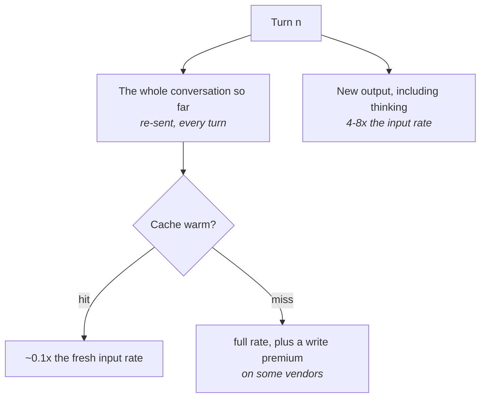

# Understand what you are paying for

## Problem

You left a session open all day and asked maybe forty questions, most of them short. That day cost
more than the day the agent wrote an entire module, and nothing in the transcript explains it. The
usual explanations fail. You were not on the expensive tier, you asked for little output, and the
one large file in play was read once. The money is not the loss. The loss is that you cannot judge
whether tomorrow's session is worth its cost, and that is the only economic question you face.

## The play

Learn the shape of one session's bill, then measure your own against it.

1. **Look at the input side first.** Chat teaches that you pay for what the model writes. In an
   agent loop you do not. Across eight frontier models on SWE-bench Verified, input drives the
   cost, not output. In the one session breakdown a vendor publishes, output is a seventh of the
   bill.
2. **Count turns, not tokens.** Every turn re-sends the whole conversation, so a loop adding *t*
   tokens per turn bills *t·n(n+1)/2* across *n* turns, not *t·n*. Twenty turns at a thousand
   tokens each is 210,000 input tokens, not 20,000. Doubling the turn count roughly quadruples the
   input bill. That makes clearing the context between unrelated tasks a cost control, not hygiene.
3. **Find your cache-hit share, and whether the cache is warm right now.** A cache read costs about
   a tenth of a fresh input token, the same multiple on all three major vendors as of September
   2026. In a long session most of your input is cache reads. Where the harness reports the hit
   rate and the warm-or-cold state, that line is the cheapest diagnostic in the subject.
4. **Learn what invalidates it, because a miss is a cliff rather than a slope.** An idle gap longer
   than the cache lifetime does it. So does editing a tool definition, which on some vendors
   invalidates the whole cache, and so does toggling anything that rewrites the system prompt.
   Where the vendor also charges to write it back, a miss-then-rewrite costs over ten times a hit.
5. **Treat the reasoning budget as a first-order control.** Thinking tokens bill as output, at four
   to eight times the input rate. The default budget can run to tens of thousands of tokens per
   request. Effort level moves a bill further than most model choices do.
6. **Reconcile against the provider's billing view at least once.** The figure your harness prints
   is a local estimate at list price. Vendors document releases where it diverged from the
   invoice. Measure the bill, not the dashboard.
7. **Attach variance to any per-task figure.** Runs on the same task with the same model differ by
   up to thirtyfold in total tokens, so a point estimate of what a feature costs cannot be planned
   against.



An agentic bill is a fact about the *shape* of the conversation, not about what you asked for. Two
sessions doing identical work bill differently if one ran in forty turns and the other in twelve, or
if one sat idle over lunch and came back cold. The vendor sets the price. You set the turn count,
the context size, and the warmth. The exchange rate is continuity and a standing habit. Clearing
between tasks means re-establishing what the agent knew, and the billing view will teach you things
you cannot act on, because thirtyfold variance does not yield to attention.

## Worked example

`granary`, a Kotlin service that ingests warehouse stock feeds from forty suppliers, had the
problem above: quiet days cost more than busy ones. One session summary, worked line by line,
settled it.

The numbers below are not `granary`'s, and not this book's. They are the sample session in
Anthropic's own Claude Code cost documentation. It is the only published session breakdown whose
arithmetic can be checked against the vendor's own stated total.

> Prices verified on Anthropic's published pricing page, 19 September 2026, and quoted per million
> tokens. They will have moved by the time you read this. The proportions are the point.

```text
Total cost:            $0.55
Usage by model:
   claude-sonnet-4-6:  1.2k input, 5.3k output, 940.0k cache read, 50.0k cache write ($0.55)
```

At that date the model listed at $3 input, $15 output, $3.75 for a five-minute cache write, and
$0.30 for a cache read. Line by line:

| Line | Tokens | Rate | Cost | Share of tokens | Share of cost |
|---|---|---|---|---|---|
| Fresh input | 1,200 | $3.00 | $0.0036 | 0.1% | 0.7% |
| Output, thinking included | 5,300 | $15.00 | $0.0795 | 0.5% | 14.4% |
| Cache reads | 940,000 | $0.30 | $0.2820 | 94.3% | 51.0% |
| Cache writes | 50,000 | $3.75 | $0.1875 | 5.0% | 33.9% |
| **Total** | **996,500** | — | **$0.5526** | 100% | 100% |

The total rounds to the $0.55 the tool printed, so the arithmetic is checkable rather than modelled.
Three counter-intuitive things fall out of it. First, you did not pay for what the model wrote:
input in all its forms is 85.6% of the bill. Second, the model had already seen almost everything it
processed: 94.3% of the tokens are the conversation re-reading itself. Third, caching did nearly all
the work. Those 991,200 input tokens at the full $3 rate, plus the same output, would have come to
$3.0531 rather than $0.5526. That is a saving of 81.9%, switched on by default.

That is also where it gets fragile. Take a coffee break long enough for the cache to expire, and the
next message writes the conversation back. The write is not the 940,000, which is reads summed over
every turn. It is roughly the 50,000 the session ever wrote. At that date's $3.75 write rate it is
$0.1875 against $0.015 warm, twelve and a half times the turn before the break. The expensive thing
in an agent session is not the model you chose or how much it wrote. It is how many times the
conversation gets re-sent, and whether it is warm when it goes.

## Failure mode

**The Expensive Nothing.** You come back from a meeting, type "yes, do that", and the turn bills a
dozen times what the one before it did. Nothing about the message was expensive. The cache went cold
while the session sat there, so the request reprocessed the whole conversation at the fresh-input
rate. On a vendor that charges to write the cache, it paid to put it back as well. The work
performed was one line of agreement.

The tell is a per-turn cost with no work behind it: a spike on a message you could have sent by
nodding. The second tell is that your most expensive days are your most interrupted ones. People
usually read that as a story about focus. It is a story about a five-minute cache lifetime and a
thirty-minute stand-up.

## Checklist

- [ ] Input and output are known as shares of the bill, not just as token counts
- [ ] Turn count is recorded alongside cost for any workflow you run repeatedly
- [ ] Context is cleared between unrelated tasks rather than once a day
- [ ] Cache-hit share and warm-or-cold state have been read this week
- [ ] What invalidates your vendor's cache is written down where the team sees it
- [ ] Reasoning effort is set per class of work, not left at the default everywhere
- [ ] The harness's local figure has been reconciled against the provider's billing view
- [ ] Any per-task cost you quote carries a range, not a single number

**See also:** [*Starve the context*](../context/starve-the-context.md) ·
[*Scope a task to fit the window*](../context/scope-a-task-to-fit-the-window.md) ·
[*Match the model to the job*](match-the-model-to-the-job.md)
