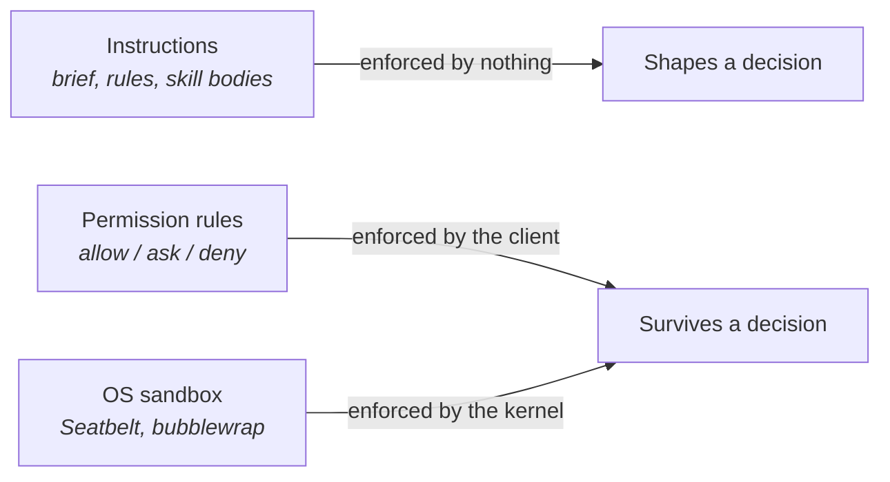

# Choose your harness

## Problem

You have views about which model to use. They took weeks to form, they are probably right, and they
matter less often than the question nobody on the team has asked: what is running the model. The
wrapper around it decides which tools exist, whether a command runs while you are at lunch, and what
the operating system does when the agent writes a path you never mentioned into `rm -rf`. You
configured it once, during installation, in about four seconds, by pressing return. The first time
that configuration is load-bearing is the first time you find out which parts of it were decoration.

## The play

Choose the harness deliberately, then move every safety assumption onto the layer that can hold it.

1. **Name the four parts of the one you are already running.** The loop — how it plans, edits,
   re-reads its own output, and decides it has finished. The tool surface — what it can call at all.
   The permission layer — what it may call without asking you. The isolation layer — what the
   operating system will refuse regardless. Find where each one is configured. If you cannot find
   the fourth, you are not running one.
2. **Sort your safety assumptions by what enforces them.** Three rows, and only two of them enforce
   anything: instructions in a brief or a skill body are enforced by nothing, permission rules are
   enforced by the client before the call runs, and an OS sandbox is enforced by the kernel for the
   process and every child it spawns. Anything you would describe out loud as a control, sitting on
   the first row, is misfiled.
3. **Tune permission rules for prompt volume, not for safety.** Allow the commands you run
   constantly, keep `ask` on the destructive ones, and read the matching rules before trusting any
   of it: compound commands are split and matched part by part, a fixed list of wrappers like
   `timeout` is stripped, and the wrappers that matter are not — `Bash(devbox run *)` approves
   whatever follows `run`
   ([`permissions-and-sandboxing.md`](../../../notes/research/permissions-and-sandboxing.md),
   Claude Code v2.1.x, September 2026).
4. **Put the boundary where the kernel can hold it, before the first unattended run.** Turn on
   filesystem and network isolation, deny reads on credential files and tokens by name — nothing is
   denied by default — and set the two flags that are not defaults: fail the run if the sandbox
   cannot start, and switch off the escape hatch that lets a command be retried unsandboxed.
   Otherwise a missing dependency on one machine downgrades that machine to no isolation and a
   warning in a log nobody reads.
5. **Use a hook for the rules a pattern cannot express** — the current branch, whether a file is
   generated, what an argument actually means. A hook sees the call before it runs and can refuse
   it, which is the thing prose cannot do.



What this is really buying is the distinction between things that shape a decision and things that
survive a bad one. Teams file the first as the second constantly, and the consequence lands in the
harness rather than in the model: a capable model that cannot run your tests produces
better-sounding output you still cannot check, while a cheaper one that can run the suite, read the
failure, and try again produces work that arrives verified. The exchange rate is friction, and it is
not small — real isolation means commands failing for reasons unrelated to your task, and with the
escape hatch off, some of those failures land on you at 16:50 on a Friday.

## Worked example

`kestrel`, a Go search-indexing service, four contributors, one shared deploy pipeline. The team
believed the agent could not push to a remote or delete anything, because of this, committed in
March:

```json
{
  "permissions": {
    "deny": ["Bash(rm *)", "Bash(git push *)"]
  }
}
```

It had never been tested, and it matched the spelling the agent usually produced, so nine months of
uneventful runs read as evidence. Against the documented matching rules it stops less than it looks:
`/bin/rm -rf build/` and `bash -c 'rm -rf build/'` are outside `Bash(rm *)`, and `git -C . push
origin main` and `git 'push' origin main` are outside the other. The vendor's own documentation says
a Bash rule "covers the invocation Claude usually produces and isn't a security boundary around the
program".

The rules stayed — they are still a fair record of what the team intends — and the boundary moved
down a layer:

```json
{
  "sandbox": {
    "enabled": true,
    "failIfUnavailable": true,
    "allowUnsandboxedCommands": false,
    "filesystem": { "denyRead": ["~/"], "allowRead": ["."] },
    "network": { "allowedDomains": ["github.com", "proxy.golang.org"] },
    "credentials": {
      "files": [{ "path": "~/.ssh", "mode": "deny" }],
      "envVars": [{ "name": "GITHUB_TOKEN", "mode": "deny" }]
    }
  }
}
```

Adoption took a fortnight rather than an afternoon. `go test ./...` failed on the first day because
module downloads went to a domain that was not on the list, which is what `proxy.golang.org` is
doing above. One contributor responded by turning the sandbox off locally and leaving it off for a
week, discovered only when somebody opened the sandbox status and found a machine reporting no
isolation. That is the ordinary shape of this change: the configuration is twenty minutes and the
adoption is a fortnight, most of it spent finding out what your build quietly reaches for.

## Failure mode

**The Paper Fence.** A rule exists, it is in version control, somebody wrote it deliberately, and
the thing it forbids happens anyway. What makes it a fence rather than a bug is that it works most
of the time — it matches the invocation the agent usually produces, so every uneventful run confirms
it. The bypasses are not clever; `git 'push' origin main` is the same command with quotes around a
word. The prose version is the same failure one layer up: a line in the brief saying never to run
migrations against production is a sentence competing for attention, not a refusal.

The tell is somebody saying "it can't do that, we have a rule" about a rule nobody has watched fire.
The second tell is a rule written against a program name rather than against a capability, because a
program name is a spelling and spellings have synonyms.

## Checklist

- [ ] You can name what runs the loop, which tools exist, what runs without asking, and what the OS
      will refuse
- [ ] Every safety assumption is written on the layer that enforces it: nothing, the client, or the
      kernel
- [ ] Permission rules are treated as prompt-volume tuning and a record of intent, not as a boundary
- [ ] No rule you rely on can be sidestepped by a wrapper, an absolute path, or a pair of quotes
- [ ] Filesystem and network isolation are on for any run you will not be watching
- [ ] The sandbox is set to fail rather than degrade, and you have checked that it actually started
- [ ] Credential files and tokens are denied or masked by name, since nothing is denied by default
- [ ] Anything needing the full command text, the branch, or an argument's meaning is a hook

**See also:** [*Wire in the outside world*](wire-in-the-outside-world.md) ·
[*Write the brief the agent actually reads*](../context/write-the-brief-the-agent-reads.md)
