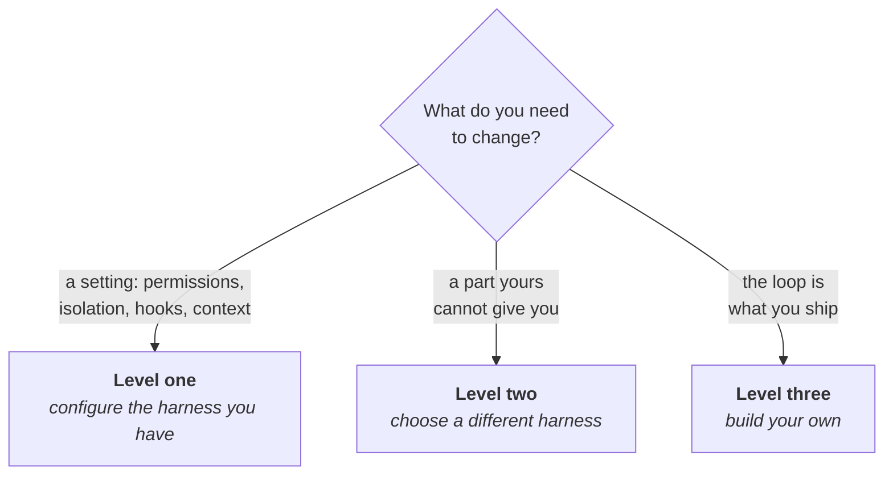

# Choose your harness

## Problem

You have views about which model to use. They took weeks to form, they are probably right, and they
matter less often than the question nobody on the team has asked: what is running the model. The
wrapper around it decides which tools exist and whether a command runs while you are at lunch. It
also decides what the operating system does when the agent writes a path you never mentioned into
`rm -rf`. When it disappoints, the reflex is to reach higher: a different tool, or a loop of your
own. If the fault was a setting nobody had read, that reflex buys a migration to fix a
configuration.

## The play

Decide how much of the harness you need to own, aim for that level, and stop there.

Start by naming the four parts of the one you already run. The loop: how it plans, edits, re-reads
its output, and decides it has finished. The tool surface: what it can call at all. The permission
layer: what it may call without asking. The isolation layer: what the operating system refuses
regardless. What you have to change sets the level: a setting, a part your harness cannot give you,
or the loop itself.



### Level one: configure the harness you have

Where nearly every team belongs, and where the other two levels start.

1. **Sort your safety assumptions by what enforces them.** Nothing enforces instructions in an agent
   file or a skill body. The client enforces permission rules before the call runs. The kernel
   enforces an OS sandbox, for the process and every child it spawns.
2. **Tune permission rules for prompt volume, not for safety.** They match spelling. Compound
   commands are split and a fixed list of wrappers like `timeout` is stripped, but the wrappers that
   matter are not: `Bash(devbox run *)` approves whatever follows `run`
   ([`permissions-and-sandboxing.md`](../../../notes/research/permissions-and-sandboxing.md), Claude
   Code v2.1.x, September 2026).
3. **Put the boundary in the kernel before the first unattended run.** Turn filesystem and network
   isolation on, and deny credential files and tokens by name. Set the run to fail if the sandbox
   cannot start, and turn unsandboxed retries off. Without those two, one missing dependency
   silently leaves a machine with no isolation.
4. **Use a hook for what a pattern cannot express**: the branch, whether a file is generated, what
   an argument means.

### Level two: choose a different harness

When a part you need cannot be configured: runs in CI with nobody watching, a model yours does not
support, isolation it does not offer. Compare candidates on your own tasks, because public rankings
hold the harness still on purpose. SWE-bench Verified's model-comparison track runs every model "in
a minimal bash environment. No tools, no special scaffold structure; just a simple ReAct agent loop"
([`single-agent-wins.md`](../../../notes/research/single-agent-wins.md)). Level one comes with you
and has to be done again.

### Level three: build your own

When the loop is what you ship: a pipeline nobody supervises, or a product with an agent inside it.
An SDK supplies the loop. The permission and isolation layers a harness used to hold are now yours
to write. Build each piece so it can be deleted when the model stops needing it ([*Make the control
flow deterministic*](../orchestration/make-the-control-flow-deterministic.md)).

Each level buys control over one more part and hands you its upkeep. The right level is the lowest
one that changes what you need; reaching higher to fix a setting is the dearest mistake on offer. At
level one the exchange rate is friction. Real isolation fails commands for reasons unrelated to your
task, some of them at 16:50 on a Friday. Above it, the exchange rate is a second harness to learn or
a loop of your own to keep alive.

## Worked example

`kestrel`, a Go search-indexing service, four contributors, one shared deploy pipeline. The team
believed this rule, committed the previous December, stopped the agent pushing to a remote or
deleting anything:

```json
{
  "permissions": {
    "deny": ["Bash(rm *)", "Bash(git push *)"]
  }
}
```

Nobody had tested it. It matched the spelling the agent usually produced, so nine months of
uneventful runs read as evidence. Against the documented matching rules it stopped less than it
looked. `/bin/rm -rf build/` and `bash -c 'rm -rf build/'` fell outside `Bash(rm *)`; `git -C .
push origin main` and `git 'push' origin main` fell outside the other. The vendor's own
documentation said so in September 2026: a Bash rule "covers the invocation Claude usually produces
and isn't a security boundary around the program".

The rules stayed as a record of intent, and the boundary moved down. The sandbox blocked a push by
withholding the token, though deletes in the tree still ran:

```json
{
  "sandbox": {
    "enabled": true,
    "failIfUnavailable": true,
    "allowUnsandboxedCommands": false,
    "filesystem": { "denyRead": ["~/"], "allowRead": ["."] },
    "network": { "allowedDomains": ["github.com", "proxy.golang.org"] },
    "credentials": {
      "files": [{ "path": "~/.ssh", "mode": "deny" }],
      "envVars": [{ "name": "GITHUB_TOKEN", "mode": "deny" }]
    }
  }
}
```

`go test ./...` failed on the first day: module downloads went to a domain not on the list, hence
`proxy.golang.org` above. One contributor turned the sandbox off locally and left it off for a
week. Nobody knew until somebody opened the sandbox status and found a machine reporting no
isolation. The configuration took twenty minutes. The adoption took a fortnight, most of it spent
finding out what the build quietly reached for.

That fortnight somebody proposed a different harness, because the agent could not run in CI. It
could: the harness already ran headless, and CI lacked only a flag and a scoped token. The team
stayed at level one.

## Failure mode

**The Paper Fence.** A rule exists, it is in version control, somebody wrote it deliberately, and
the thing it forbids happens anyway. It is a fence rather than a bug because it works most of the
time. It matches the invocation the agent usually produces, so every uneventful run confirms it.
The bypasses are not clever: `git 'push' origin main` is the same command with quotes around a
word. The prose version is the same failure one layer up. A line in the agent file saying never to
run migrations against production is a sentence competing for attention, not a refusal.

The tell is somebody saying "it can't do that, we have a rule" about a rule nobody has watched fire.
The second tell is a rule written against a program name rather than a capability, because a
program name is a spelling and spellings have synonyms.

## Checklist

- [ ] The level aimed for is the lowest one that changes what you need
- [ ] You can name what runs the loop, which tools exist, what runs without asking, and what the OS
      will refuse
- [ ] Every safety assumption is written on the layer that enforces it: nothing, the client, or the
      kernel
- [ ] Permission rules are prompt-volume tuning, and none you rely on falls to a wrapper, an
      absolute path, or a pair of quotes
- [ ] Filesystem and network isolation are on for any run you will not be watching
- [ ] The sandbox is set to fail rather than degrade, and you have checked that it actually started
- [ ] Credential files and tokens are denied or masked by name, since nothing is denied by default
- [ ] Anything needing the full command text, the branch, or an argument's meaning is a hook

**See also:** [*Wire in the outside world*](wire-in-the-outside-world.md) · [*Write the agent file
that actually gets read*](../context/write-the-agent-file-that-actually-gets-read.md)
