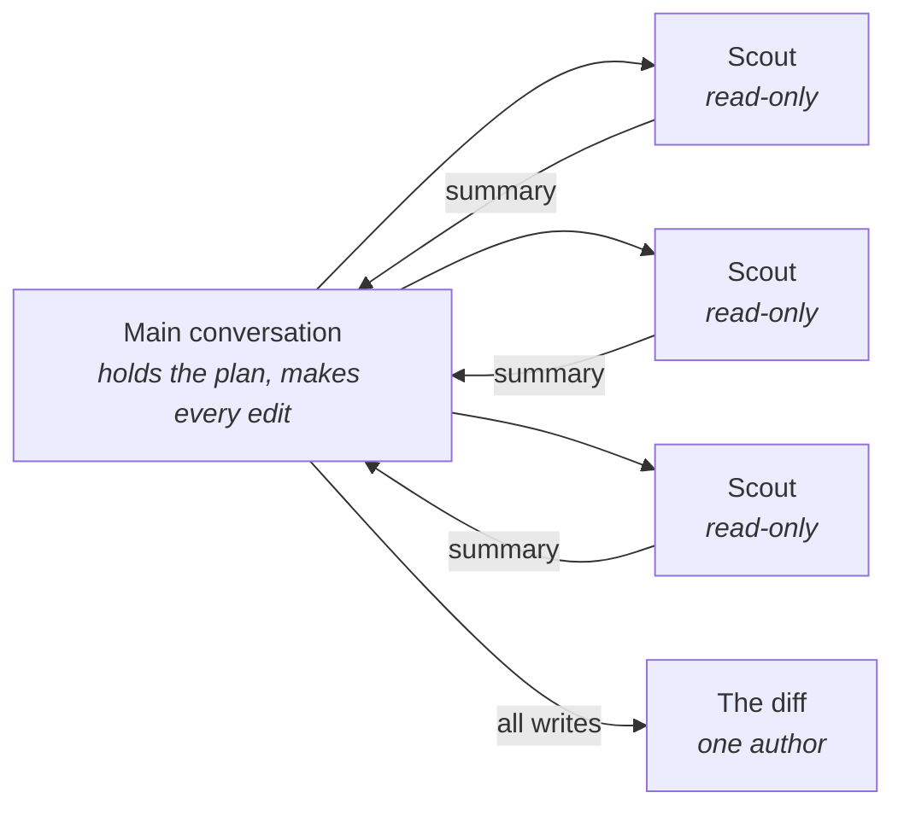

# Decompose into subagents

## Problem

The task was too large for one window, so you split it five ways and started five agents. Forty
minutes later you have five summaries, each a tidy paragraph reporting success, and a branch holding
three helpers that do the same job under different names, plus one module written against an
interface a second agent changed underneath it. Nothing failed. Every worker did what it was asked.
What it cost you is a reconstruction job — working out, from five paragraphs, what five long
transcripts actually did, and the transcripts are the one thing you did not get.

## The play

Fan out to read. Keep every write in one place.

1. **Delegate work whose output you do not want to keep.** A survey, an audit, a dependency trace, a
   test run that prints four hundred lines to say one thing: the subagent spends its own window on
   the noise and hands back the conclusion. Work that gets iteratively refined, or where planning,
   implementing, and testing depend on the same understanding, stays in the main conversation. That
   second case is where delegation reliably costs more than it saves, because each handoff sheds
   what the previous stage knew.
2. **Single-thread the writes.** Cognition's position as of April 2026, ten months after *Don't
   Build Multi-Agents*, is that multi-agent systems work when writes stay single-threaded and the
   extra agents contribute intelligence rather than actions. Two agents editing toward one goal make
   conflicting implicit decisions, and reconciling them lands on you.
3. **Make read-only mechanical rather than polite.** A tool allowlist in the subagent's definition —
   in Claude Code 2.x, `tools: Read, Glob, Grep` in the frontmatter — removes the write tools from
   the worker entirely. A sentence in the prompt asking it not to edit files is a request competing
   for attention with everything else you wrote.
4. **Fix the return format, and choose one you can check by other means.** A worker that returns a
   table with a count at the bottom gives you something to compare against a `ripgrep` run. A worker
   that returns prose gives you something to believe.
5. **Write the convention down before you delegate.** A subagent inherits your project context files
   and none of your conversation. A rule you established in chat forty turns ago is silently absent;
   the same rule in `AGENTS.md` is loaded. Nothing errors either way.
6. **Spend the tokens on one agent first.** Multi-agent advantages shrink or disappear when thinking
   tokens are held constant, and in the one protocol-matched comparison available — six systems,
   GPT-4.1, June 2026 — five underperformed a single-agent baseline by between two and eleven
   percentage points while costing more
   ([`single-agent-wins.md`](../../../notes/research/single-agent-wins.md)). Before concluding that
   a fan-out won, give one agent the same budget and measure.



What delegation reliably buys is context isolation, and nothing else. The noise stays in a window
you will never see, and the conclusion arrives small enough to reason about. Every other advantage
people attribute to subagents — speed, quality, coverage — is contested, domain-dependent, or turns
out on inspection to be a larger compute budget wearing a hat. Reach for a subagent when the
isolation is the point and the work has a boundary somebody could describe in one sentence. The
exchange rate is verification: you pay roughly one context per worker, you give up the ability to
watch the work happen, and what comes back is a summary that reads exactly the same whether it was
thorough or not.

## Worked example

`meridian`, a Ruby freight-booking platform whose monorepo holds nineteen deployable services, was
replacing a positional constructor — `Billing::Client.new(url, opts)` — with a keyword form. Nobody
knew how many call sites there were. Done inline, the grep output across four large directories
filled the window before a single edit happened.

The scout was one file, `.claude/agents/call-site-scout.md`:

```markdown
---
name: call-site-scout
description: Inventories Billing::Client.new call sites in one directory. Use before an API
  migration to survey a single area. Returns an inventory only; never edits files.
tools: Read, Glob, Grep
---

You audit exactly one directory, named in your prompt. Find every call site of
`Billing::Client.new` and classify each one.

Return ONLY this, and nothing else:

## <directory>
| file:line | argument shape | splatted opts? | risk |

Then one final line: TOTAL=<n> RISKY=<n>
```

Four delegations, one per area — `services/booking`, `services/tariffs`, `services/tracking`, and
`engines/billing` — then every edit made in the main conversation from the four returned tables. The
`tools` line was what made the write isolation real; the fixed return format was what made the next
step possible:

> Captured September 2026, ripgrep 15.2.0 and BWK awk 20200816.

```bash
$ rg --count-matches 'Billing::Client\.new' services/ engines/ \
    | awk -F: '{ total += $2 } END { print total }'
52
```

The scouts' `TOTAL=` values summed to 47. The independent count, across every service, said 52; the
other fifteen services had none. The gap was in `services/tracking`, where one scout had stopped at
a directory it read as vendored and said so nowhere in its summary. That is the whole argument for
the fixed format in one number: the fan-out was wrong, and finding out cost one command rather than
a production incident. The full transcript of that scout was on disk the entire time — Claude Code
2.x keeps subagent transcripts under `~/.claude/projects/` for a configurable retention period — and
nobody would have opened it without a reason to look.

## Failure mode

**The Tidy Summary.** The worker returns four hundred words of well-organised prose, correct in
every particular it mentions, and there is no way to tell it from the version that quietly skipped a
directory. This is not a lie the agent told; it is the format doing what it was asked. Compression
to a summary is the entire reason you delegated, and the compression is lossy in exactly the places
you would want to check. The harness reinforces it — the parent receives the final message and
nothing else, across every vendor that ships this feature — so the omission is not hidden so much as
never surfaced.

The tell is a summary you cannot disagree with. If nothing in the returned text is checkable against
something the worker did not produce, you have accepted a claim, not a result. The second tell is
noticing you have never opened a subagent transcript, on a workflow that has run for weeks.

## Checklist

- [ ] The delegated work is read-heavy and produces more text than conclusion
- [ ] Every write in the run happens in one place
- [ ] Read-only workers have write tools removed, not discouraged
- [ ] The return format is fixed and includes something countable
- [ ] The result was cross-checked against a source the worker did not produce
- [ ] Conventions the workers rely on are in a project file, not in the conversation
- [ ] A single agent with the same token budget was tried before the fan-out was kept

**See also:** [*Scope a task to fit the window*](../context/scope-a-task-to-fit-the-window.md) ·
[*Work in parallel without collisions*](work-in-parallel-without-collisions.md) ·
[*Make the agent prove it*](../verification-and-trust/make-the-agent-prove-it.md)
