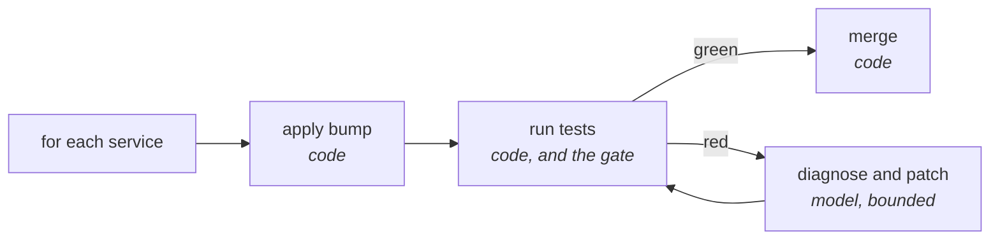

# Make the control flow deterministic

## Problem

You asked one agent to upgrade a shared library across nineteen services. It handled the first six
well. By the eleventh it was applying a fix it had invented at service four to a service that never
had the problem, and by the fifteenth it had started reasoning about the failures it caused at
service eleven. The run ended with a message saying the upgrade was complete. It was complete on
some of them. Nobody can tell you which, because the only record of what happened is a transcript
that nobody is going to read to the end.

## The play

Split the sequence on reversibility and horizon, not on difficulty.

1. **Write down the stages you can already name.** If you can list the steps and state the condition
   that has to hold between each pair of them, that list is code, and the model's job is what
   happens inside a stage rather than which stage runs next. The gate between stages is a
   programmatic check — a test suite, an exit code, a schema — not a judgement.
2. **Rate every action the run can take, and let code perform the expensive ones.** OpenAI's agent
   guide asks for a low, medium, or high rating on each tool against read-versus-write access,
   reversibility, permissions, and financial impact. Anything rated high is performed by your code,
   after a check your code ran. The model proposes the merge; it does not hold the merge tool.
3. **Keep model-driven work at the leaves, on a step budget.** 12-Factor Agents puts the working
   range at three to ten steps, twenty at the outside — a practitioner heuristic rather than a
   measurement, but it rhymes with the measured result that per-step reliability falls as
   trajectories lengthen, hardest of all in software engineering
   ([`control-flow.md`](../../../notes/research/control-flow.md)).
4. **Own the loop rather than renting it.** A loop you wrote is where logging, retries, caching, and
   a pause between tool selection and tool invocation live. That pause matters most: it is the only
   place a human approves an action before it happens rather than after.
5. **Name what a framework or a canvas is actually selling.** As of September 2026, LangGraph's
   product is resumability: a checkpointer plus a thread identifier lets a run pause inside a tool
   call, survive a redeploy, and continue from that point. n8n's is the edges — several hundred
   maintained connectors, credentials, schedules, retries, and a canvas a non-developer can open.
   Both are real. Neither is control flow you understand, and the line falls where your routing
   acquires state and conditionals: past that point the logic sits in a text field with no tests and
   a diff that mixes "moved a node" with "changed the routing rule".
6. **Build each scripted stage so you can delete it.** Anthropic's own formulation is that every
   component in a harness encodes an assumption about what the model cannot do alone, and those
   assumptions are worth stress testing. A stage that exists because last year's model lost track
   after step eight should come out in one deletion.



It holds up because it separates two things the discourse keeps fusing. Enumerability is about
whether you can name the steps; judgement is about whether a rule can decide the answer. A task can
be wildly difficult and perfectly enumerable; the difficulty belongs at a leaf and the enumeration
belongs in code. The exchange rate is adaptability and maintenance: a scripted pipeline handles the
cases you thought of and stops dead at the one you did not, and the script is yours to maintain, in
exchange for being able to say what ran.

## Worked example

`meridian`, a Ruby freight-booking platform whose monorepo holds nineteen deployable services, had a
bot opening a pull request whenever a shared gem was bumped. The first version of the triage lived
on an n8n canvas, and for a fortnight it was the right call: the GitHub webhook, the Slack post, the
retry policy, and the schedule were configuration rather than code, and the on-call engineer could
open the canvas and read it.

It outgrew that in three months, in the usual way. Release-branch bumps had to page on-call. Two
services were exempt. A gem that had failed twice in a day was not to be retried a third time, which
is state. The routing became a 120-line Code node with no tests, and diagnosing a mis-routed
security bump took an afternoon because the only record was an execution log in a web UI.

The rewrite kept n8n for the edges and moved the judgement into `scripts/upgrade.py`:

```python
for service in services:                 # nineteen short runs, not one long one
    apply_bump(service, gem, version)
    result = run_tests(service)
    if result.failed:
        result = agent_patch(service, result, max_steps=8)   # the only model step
    if result.passed and not service.release_branch:
        merge(service)                   # performed by code, never by the agent
    else:
        escalate(service, result)
```

Nineteen short trajectories instead of one long one, the suite as the gate, and the merge in the
hands of the caller. LangGraph was seriously considered, because a release-branch escalation can sit
until morning and resuming inside a tool call is what its checkpointer is for. What settled it is
the part build-versus-adopt arguments skip: a checkpoint is a save point, not a supervisor. When the
box died mid-run on a Thursday, nothing woke up and resumed anything, and LangGraph would not have
either. A cron scanning for stale runs was needed in both designs, and it was written after the
incident rather than before, like all of them.

## Failure mode

**The Load-Bearing Scaffold.** A stage was added because a model kept losing the thread partway
through a long job. Two model releases later it would not lose the thread, and the stage is still
there — not because anyone believes in it, but because the retry logic, the metrics, and two other
stages' assumptions have grown into it, and removing it means touching all of them. The pipeline is
now shaped around a limitation that no longer exists, which is a difficult thing to notice, because
everything still passes.

The tell is being unable to say which capability gap a stage was built to cover. The second is
finding that the model-driven leaf inside a stage has been quietly narrowed over time until the
stage does nothing but call a function, and nobody proposed deleting it, because it works.

## Checklist

- [ ] The stages are named, and the condition between each pair is checkable by code
- [ ] Every irreversible action is performed by code, after a check code ran
- [ ] The model's work is bounded by a step budget at a leaf, not spread across the run
- [ ] The loop emits a record of what ran, per item, that someone can read afterwards
- [ ] What each adopted framework or canvas is buying you is stated in one sentence
- [ ] Each scripted stage names the capability gap it exists to cover
- [ ] Removing any one stage is a deletion, not a rewrite
- [ ] Something outside the run detects a run that stopped

**See also:** [*Scope a task to fit the window*](../context/scope-a-task-to-fit-the-window.md),
before the stages can be named ·
[*Decompose into subagents*](decompose-into-subagents.md) ·
[*Choose your harness*](../harness/choose-your-harness.md) ·
[*Know when not to use an agent*](../economics/know-when-not-to-use-an-agent.md)
