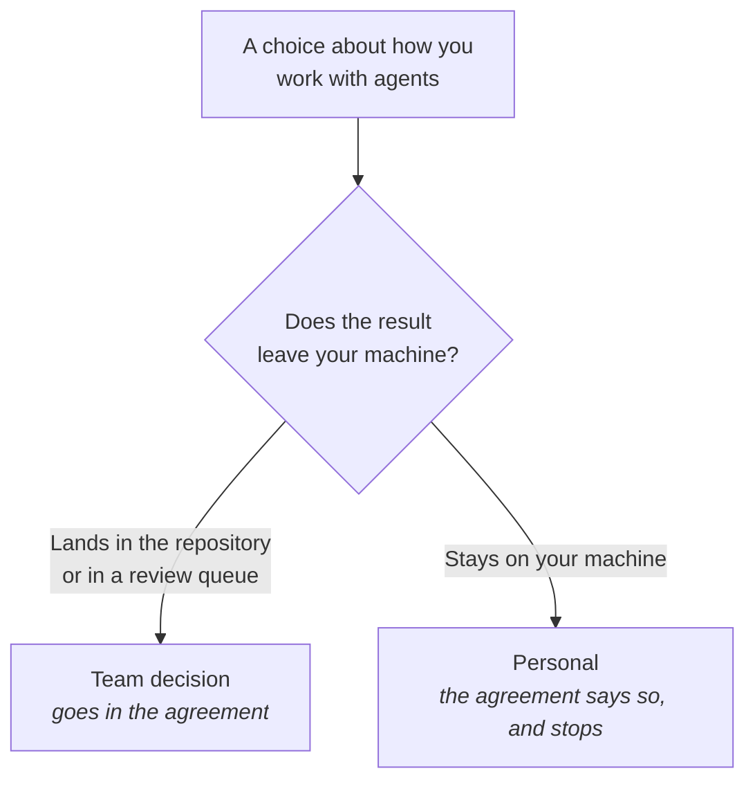

# Build the working agreement

## Problem

Nine people, nine ways of working, and not one of them is wrong. One commits the agent's plan in the
pull-request description; another thinks that is noise. One keeps a private overrides file full of
conventions nobody else knows exist. Two have quietly stopped reviewing agent-authored changes as
carefully as they review everyone else's, and would not say so out loud. None of this was decided.
What it costs is that every code review is now also a small referendum on how the team ought to
work, held between two people, at the worst available moment.

## The play

Decide the few things with consequences for other people, write them on one page, and give the page
a trigger.

1. **Start from the disagreements you already have.** Read the last twenty agent-authored pull
   requests and list every place two of them differ: whether tests arrived with the change, whether
   the plan is in the description, whether anyone said an agent wrote it. That is the agenda. A rule
   for anything not on it solves a problem the team does not have.
2. **Sort each item by whether the result leaves your machine.** Landing in the repository or in
   somebody else's review queue makes it a team decision. Everything else — which harness, which
   model, how many sessions you keep open, what is in your own skills directory — stays yours, and
   the agreement says so in writing.
3. **Agree the items with team-visible consequences.** Usually six: which context files are shared
   and where personal ones go; whether agent authorship is disclosed; what "done" means for an
   agent-authored change; what a reviewer may decline; who can see what the tools cost; and what the
   team never delegates. The fourth is the one teams omit, and it is the one the measurements say
   costs most: under a doubling mandate, review coverage falls and each remaining reviewer's load
   doubles
   ([*Where the time actually goes*](../../part-3-where-it-struggles/where-the-time-actually-goes.md)).
4. **Write it in the repository, at one page.** Beside the shared context file, not in a wiki nobody
   has open. A page that fits on a screen gets re-read; a longer one gets cited rather than
   followed.
5. **Give it a trigger rather than a date, and a standing exception.** "Revisit this quarterly"
   survives one quarter; events survive — a model release the team adopts, a new tool anyone wants
   to bring in, the second time somebody cites the agreement and it turns out to be wrong. Anyone
   may work against the agreement deliberately, provided they say so in advance and report what
   happened. Date the page, version it, and let anyone amend it by pull request.



The value is not the content. It is that a disagreement now has somewhere to go — an amendment
rather than an argument in a review thread — and that an agreement reaching into how people work,
rather than into what they produce, gets adopted in appearance and abandoned in private. So the page
describes changes rather than people. "Everyone must review agent output carefully" is about
individuals, is not checkable, and to a team told to adopt these tools and not told how it reads as
measurement of them; "a change is not done until a test that could have failed covers it" is about
work, and anyone can see whether it happened. Assume a mixed room: in DORA's 2025 survey roughly a
quarter of respondents reported high trust in AI-generated code and roughly thirty per cent reported
little or none. The exchange rate is that some agreed defaults will be wrong for some tasks and you
will follow them anyway, plus an afternoon to write the page and a shorter one whenever a trigger
fires. A skeleton of the page, with the specifics stripped out, is in
[*Copy-paste templates*](../../appendices/copy-paste-templates.md).

## Worked example

`lodestone`, a claims-processing platform — C# services behind a TypeScript front end — maintained
by nine engineers across two time zones. Reading the last twenty agent-authored pull requests turned
up four live disagreements and no rules at all. Sorting them took longer than agreeing them: two
were about what a change had to carry, one was about review load, and one turned out to be about
which model people preferred, which went in the personal column and stopped being an argument.

The result was one file, `docs/agent-working-agreement.md`:

```markdown
# How we work with agents — lodestone

Version 3, 2026-09-12. Amend by pull request; anyone may open one.
Last changed because: our August model upgrade made the one-file-per-run rule pointless.

## Shared, and in the repository
- Project instructions live in `AGENTS.md` at the repo root. Anything a new joiner
  needs on day one belongs there.
- Team skills live in `.claude/skills/`. Personal skills stay in your home directory.
- Do not commit a `CLAUDE.md` or a `CLAUDE.local.md`. On Claude Code 2.x either one
  stops `AGENTS.md` loading, silently, for whoever has it.
- If you keep personal agent notes above the checkout, set `claude-md-and-agents-md`
  in `/config` yourself. That setting is per-user and cannot be committed.

## What a change has to carry
- A test that could have failed before the change, or a line in the description
  saying why there cannot be one.
- An `Assisted-by:` trailer when an agent wrote most of the diff. We do not track
  which lines.
- A description written by you. The agent's plan may be pasted below it, marked.

## Review
- Any reviewer may return a pull request over 400 lines unread and ask for it split.
  No explanation is owed and none is taken personally.
- Agent-authored changes get the same review as anyone else's. If yours is the third
  one today, say so and ask for a second reviewer.

## Money and limits
- Monthly spend is posted in the team channel on the 1st. Nobody is asked about
  their share.
- We do not delegate: schema migrations, anything under `Billing/`, or the release
  script. Reviewed 2026-09-12.

## Yours, not ours
- Which harness, which model, which editor, how you prompt, what is in your own
  skills directory, how many sessions you run at once.

## Experiments
- Standing exception: say in advance that you are working against this agreement on
  purpose, and report what happened at the next harvest.
```

Two of the four disagreements were settled by being written down and did not come back. The third —
whether the agent's plan belongs in the description — landed as "pasted below it, marked", which
nobody liked and everybody could live with, and it is the line most likely to move at the next
trigger. The fourth did not survive contact with the page: "we always run the tests before asking
for review" turned out to describe what four people did and what five people intended to do, and it
was rewritten as a condition on the change rather than an instruction to the person.

The page is at version three. Versions one and two were written in a wiki, which is where they still
are.

## Failure mode

**The Founding Document.** The agreement was written in a good week, by people who cared, and it was
right. Two model releases later it still describes a tool that needed work split into one file per
run and a review rule sized for diffs nobody produces any more. Nobody has amended it, because
amending it feels like reopening a settled thing and the people who wrote it have moved on to other
arguments. So it gets quoted rather than followed: cited in a review thread when somebody wants to
win, ignored on the four days a week when following it would be inconvenient, and defended in
principle by everyone.

The tell is a document with a date on it that is older than the model everybody is using. The second
tell is hearing "well, technically the agreement says…", which is a sentence people reach for only
about a rule they have stopped believing in. It is not the Paper Fence
([*Choose your harness*](../harness/choose-your-harness.md#failure-mode)): that is a rule a machine
was never going to honour, and this is a rule the people have quietly stopped honouring.

## Checklist

- [ ] The agenda came from disagreements in real pull requests, not from a blank page
- [ ] Every rule concerns something that leaves a machine; the rest is written down as personal
- [ ] Shared and personal context files are named, and the personal ones stay out of the repository
- [ ] What a reviewer may decline is stated, with no explanation owed
- [ ] The page is in the repository, fits on a screen, and anyone may amend it
- [ ] It carries a date, a version, and a line saying what last changed and why
- [ ] The next revision is triggered by an event, not by a month
- [ ] A standing exception exists for deliberate experiments, with an obligation to report back

**See also:** [*Decide who signs off*](../verification-and-trust/decide-who-signs-off.md) ·
[*Collect and refine as a team*](collect-and-refine-as-a-team.md) ·
[*Onboard someone into all this*](onboard-someone-into-all-this.md)
