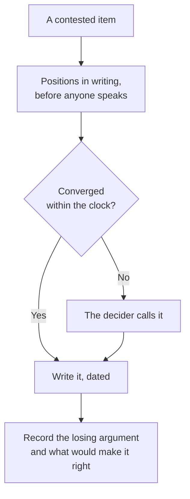

# Settle what the team cannot agree

## Problem

The agenda is sound and the meeting goes round. Two engineers hold reasonable positions on whether
the agent's plan belongs in the pull request description, both have been right before, and neither
is going to produce the argument that moves the other. Forty minutes in, somebody offers to take it
away and think about it. Nothing is written. The disagreement goes back to where it came from — a
review thread, one pull request at a time, argued again by whoever is on shift — and the page that
was supposed to end that is now a draft nobody owns.

## The play

Decide the contested items on a clock, with somebody named to break ties, and record what lost.

1. **Name the decider before the discussion, not after.** One person, said out loud at the start,
   who settles anything still open at the bell. A group that picks a tie-breaker while tied picks a
   position rather than a person. The role is borrowed from time-boxed product-design practice,
   where it exists for the same reason: to stop a decision costing more than the thing being
   decided.
2. **Take positions in writing before anyone speaks.** Two or three sentences each, submitted
   before the meeting, visible to everyone at once. The first person to speak otherwise sets the
   frame, seniority decides more than it should, and a team split across time zones cannot
   participate at all.
3. **Give each item a clock.** Ten minutes is usually generous for a decision that has already been
   argued for a month in a review queue. What has not converged in ten minutes is not going to
   converge in forty.
4. **Decide provisionally, and date the decision.** A dated call with a trigger that revisits it
   beats an open question, because an open question is settled by whoever is reviewing at the time.
   The triggers are the ones the page already carries ([*Build the working
   agreement*](build-the-working-agreement.md)).
5. **Write the losing argument next to the decision.** One line: what the other position was, and
   what would make it right. Without it the item reopens from nothing every time somebody new asks
   why, and the team argues it a second time from a worse starting position.
6. **Leave with a change to the work, not a principle.** "We value thorough review" is not
   checkable and nobody can tell whether it happened. "A reviewer may return a pull request over
   400 lines unread" is a change to what the work has to look like, and anyone can see it.

This works because the expensive thing is not the wrong call, it is the open one. A decision written
down and dated can be found, cited, and amended by anyone who thinks it is wrong; an item left open
is decided anyway, repeatedly, by whoever happens to be reviewing, and each of those decisions is
invisible and unappealable. Recording what lost is what makes the call cheap to revisit, which is
what makes deciding early affordable in the first place. The exchange rate is that some provisional
calls will be wrong and the team will follow them until a trigger fires, plus the cost of naming a
decider on a team that would rather not have one.

## Worked example

`lodestone`, a claims-processing platform — C# services behind a TypeScript front end — maintained
by nine engineers across two time zones, had four disagreements on its agenda and settled three of
them by writing them down. The fourth was whether the agent's plan belonged in the pull request
description. Two engineers had argued it in review threads for six weeks.

Positions went into a shared document the day before, three sentences each. One held that the plan
is how a reviewer knows what the agent was asked, and that hiding it wastes the cheapest context
available. The other held that a description is a claim the author is making, and pasting a
machine's plan under it makes the author's own summary optional.

The clock ran nine minutes. Nobody moved. The decider — the engineer who had run the previous two
agreements, named at the top of the meeting — called it: the plan may be pasted below the
description, marked, and the description is still written by a person. The page recorded the losing
case in one line: *plans are cheap reviewer context; revisit if reviewers start skipping the
description.*

Nobody liked it and everybody could live with it, which is what a provisional call usually feels
like. It held for five weeks. At the next model upgrade the plans got long enough that two reviewers
admitted to scrolling past them, which was the condition written in the losing line, and the item
came back with the argument already on the page rather than in anyone's memory. Version four says
plans go in a collapsed block.

## Failure mode

**The Nodded-Through Agreement.** Every item passes on the first pass. The meeting finishes early,
the page is written, and nothing anyone does on Monday is different. The mechanism is that the room
agreed to a principle rather than to a change in the work: "we review agent output carefully" is
unopposable, which is exactly why it settles quickly and why nobody can tell whether it is being
followed. The tell is a page with no losing arguments recorded anywhere on it, because items that
nobody argued against produce none. The second tell arrives later, when the same disagreement
reappears in a review thread and both parties can cite the agreement, each correctly.

## Checklist

- [ ] The decider was named before the first item, not chosen once the team was tied
- [ ] Positions were written and shared before anyone spoke
- [ ] Each contested item had a clock, and the bell meant something
- [ ] Every decision carries a date and the trigger that revisits it
- [ ] The losing argument is on the page, with what would make it right
- [ ] Each item names a change to the work rather than a value the team holds
- [ ] Nothing was left open on the grounds that it needed more thought

**See also:**
[*Build the working agreement*](build-the-working-agreement.md) ·
[*Collect and refine as a team*](collect-and-refine-as-a-team.md)
