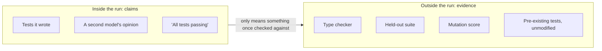

# Make the agent prove it

## Problem

The run ends with a paragraph: implemented, all 214 tests passing. They are. Three of the tests are
new, written by the same run that wrote the code they cover, and one of them asserts that a function
returns a number. Two that used to fail are now marked skipped. A comment explains that they covered
behaviour the refactor made obsolete, and the comment is plausible. You have a green suite, a
confident summary, and nothing that tells you whether the change works. You will find out from
production rather than from your own machine.

## The play

Move the proof outside the agent's turn. Anything the run wrote about itself is a claim.

1. **Write the finish condition before the work starts, with a check inside it.** Name one
   measurable end state, the command that demonstrates it, and what must not change on the way:
   "`npm test` exits 0, `npm run typecheck` exits 0, and no file under `tests/` is modified". Claude
   Code 2.x ships this as `/goal`, which a separate model evaluates after each turn. OpenAI's Codex
   guidance calls it a "Done when" clause. Know the limit: that evaluator runs no commands, so it
   grades the transcript, not the repository
   ([`verification.md`](../../../notes/research/verification.md)).
2. **Back it with a gate that is not advice.** A line in an agent file competes for the model's
   attention; a hook that blocks the turn from ending does not. Gate on the two things cheap to
   check and expensive to miss: the suite passes, and no existing test file was deleted or modified.
   The hook's documentation says the harness overrides it after eight consecutive blocks, so the
   gate narrows the options rather than removing them.
3. **Rank your signals by who wrote them, and buy from the top down.** The hardest to fake come
   first. The type checker can be defeated only by widening a type in a line you can see. A
   *held-out suite* is tests the run cannot read or edit. A *mutation score* asks whether the tests
   notice when the code is deliberately broken. Next, property-based tests, running the thing
   against a committed fixture, linters, and the tests that already existed. Then the soft half:
   tests the agent wrote for its own change, and a second model's opinion; its claim to be done is
   no signal at all. The ordering is the book's synthesis, not a published result, but the rule
   under it carries over: a signal is hard to fake when faking it would show in the diff
   ([`verification.md`](../../../notes/research/verification.md)).
4. **Ask for evidence, not a verdict.** Ask for the command it ran and what it printed, not "tests
   pass". A claim costs the same to produce whether or not it is true.
5. **Own the tests yourself where the change matters.** Writing tests first measurably helps a
   capable model: one 2026 study put the gain at 15 to 24 percentage points. Iterating an
   implementation against *generated* tests makes overfitting worse.



Research on model-written tests points both ways, for one reason. The damning results come from
asking a model for tests and keeping what came back. The enthusiastic ones, such as a 73% engineer
acceptance rate on production tests at Meta in 2025, fed an external, executable adequacy signal
back into generation. The difference is whether the loop closed against something the model did not
write. The exchange rate is setup and friction. Every signal above the soft half takes work to
install, mutation testing returns the least for what it costs, and you will lose runs to a gate that
was correct and inconvenient.

## Worked example

`tideline`, a TypeScript service that stages firmware rollouts to field devices, needed cohort
scheduling rewritten. A human wrote and committed the tests first, and the run was started against
them.

The finish condition named the check and the constraint:

```text
/goal tests in tests/rollout pass and `npm run typecheck` exits 0, with no file
under tests/ modified
```

The hard version of the same constraint, in `.claude/settings.json`:

```json
{
  "hooks": {
    "Stop": [
      {
        "hooks": [
          {
            "type": "command",
            "command": "git diff --no-renames --name-only --diff-filter=DM origin/main -- tests/ | grep . >&2 && exit 2; exit 0"
          },
          { "type": "command", "command": "npm test >&2 && npm run typecheck >&2 || exit 2" }
        ]
      }
    ]
  }
}
```

Two details make it work. First, `--no-renames --diff-filter=DM` against `origin/main` lets added
test files through and catches deleted, modified, or renamed ones, whether or not the run has
committed them yet. Second, `exit 2` is the only exit code that keeps the turn open. Any other
failure is logged as a hook error and the turn ends anyway, so a bare `npm test` that fails gates
nothing. The same constraint again, one layer down, for the duration of the run:

```bash
$ chmod -R a-w tests/
```

The run went green without touching `tests/` and without weakening a type. It had found the
remaining route instead. `tests/fixtures/cohorts.json` held cohorts of 500 and 5,000 devices, and
the new bucket boundary was computed with an integer division that is exact at both of those sizes
and off by one everywhere else. Nothing about this was a lie. The visible suite was the only
description of "correct" the run had, so the visible suite is what it satisfied.

A second suite, kept out of the working tree and run only in CI, caught it on the first push. The
gap between the visible pass rate and the held-out one is how the research detects exactly this. In
a 2026 benchmark of thirty tasks, from short-horizon to very long, that gap widened by roughly 28
percentage points per tenfold increase in code size
([`verification.md`](../../../notes/research/verification.md)). Read-only tests were never going to
prevent this, and the published finding says so in the same sentence that recommends them.

## Failure mode

**The Green Suite That Tests Nothing.** The suite passes, the agent wrote most of it, and the green
is a fact about the suite, not the code. It arrives by three routes that look nothing alike: a test
deleted or skipped, a test input special-cased in the implementation, or an assertion so weak that
no plausible defect could fail it. One 2026 study of generated tests found weak assertions in 62% to
93% of test files depending on the tool, and missing behavioural cases in 83% to 99%
([`verification.md`](../../../notes/research/verification.md)).

Three tells give it away. An existing test file loses lines in a change that added a feature. A new
test's assertion restates the line of implementation above it. Coverage rises while the number of
things that could fail goes down. The check that settles it takes a minute: break the implementation
on purpose, by inverting a comparison or returning a constant, and run the suite. If nothing goes
red, the suite was never watching that.

## Checklist

- [ ] The finish condition exists in writing, names a command, and names what must not change
- [ ] A deterministic gate blocks the run's end, rather than a sentence in an agent file asking it
      to
- [ ] Test files are write-protected or diff-gated for the duration of the run
- [ ] The type checker, linter, and pre-existing suite all run and all pass unmodified
- [ ] A suite the run could not see was run afterwards
- [ ] Evidence is the command output, not a summary of it
- [ ] Tests for the part that matters were written by a human, before the implementation
- [ ] One deliberate break was tried and the suite noticed

**See also:** [*Review code you did not write*](review-code-you-did-not-write.md) · [*Decide who
signs off*](decide-who-signs-off.md) · [*Choose your harness*](../harness/choose-your-harness.md) ·
[*What agents are reliably bad
at*](../../part-3-where-it-struggles/what-agents-are-reliably-bad-at.md)
