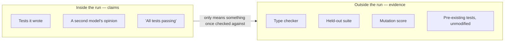

# Make the agent prove it

## Problem

The run ends with a paragraph: implemented, all 214 tests passing. They are. Three of them are new
and were written by the same run that wrote the code they cover, and one of those asserts that a
function returns a number. Two that used to fail are marked skipped, with a comment explaining that
they covered behaviour the refactor made obsolete, and the comment is plausible. You have a green
suite, a confident summary, and nothing that tells you whether the change works — which means you
will find out from production rather than from your own machine.

## The play

Move the proof outside the agent's turn. Anything the run authored about the run is a claim.

1. **Write the finish condition before the work starts, with a check inside it.** One measurable end
   state, the command that demonstrates it, and the constraints that must not change on the way:
   "`npm test` exits 0, `npm run typecheck` exits 0, and no file under `tests/` is modified". Claude
   Code 2.x ships this as `/goal`, evaluated after each turn by a separate model; OpenAI's Codex
   guidance asks the same as a "Done when" clause. Know the limit: that evaluator runs no commands,
   so it grades the transcript rather than the repository
   ([`verification.md`](../../../notes/research/verification.md)).
2. **Back it with a gate that is not advice.** A line in a brief competes for the model's attention;
   a hook that blocks the turn from ending does not. Gate on the two things cheap to check and
   expensive to miss: the suite passes, and no existing test file was deleted or modified. The
   documentation describing that hook also says the harness overrides it after eight consecutive
   blocks, so it narrows the options rather than removing them.
3. **Rank your signals by who authored them, and buy from the top down.** Hardest to fake first: the
   type checker, defeatable only by widening a type in a line you can see; a *held-out suite*,
   meaning tests the run cannot read or edit; a *mutation score*, which asks whether the tests
   notice when the code is deliberately broken; property-based tests; running the thing against a
   committed fixture; linters; the tests that already existed. Then the soft half: tests the agent
   wrote for its own change, a second model's opinion, and its assertion that it is done, which is
   not a signal. That ordering is this book's synthesis rather than a published result; the portable
   part is the rule under it — fakeability tracks whether the evasion shows up in the diff
   ([`verification.md`](../../../notes/research/verification.md)).
4. **Ask for evidence, not a verdict.** The command it ran and what the command printed, not "tests
   pass". A claim costs the same to produce whether or not it is true.
5. **Own the tests yourself where the change matters.** Test-first measurably helps a capable model
   — one 2026 study put it at 15 to 24 percentage points — while iterating an implementation against
   *generated* tests makes overfitting worse. Test-first helps when a human owns the test, and
   backfires when the agent owns both sides of the loop.



The disagreement about whether model-written tests are any good is where this becomes visible. The
damning results come from asking a model for tests and keeping what came back; the enthusiastic ones
— a 73% engineer acceptance rate on production tests at Meta in 2025 — fed an external, executable
adequacy signal back into generation. The variable is not the model; it is whether the loop closed
against something the model did not author. The exchange rate is setup and friction: every signal
above the soft half costs work to install, mutation testing has the worst cost-to-benefit ratio of
the lot, and you will lose runs to a gate that was correct and inconvenient.

## Worked example

`tideline`, a TypeScript service that stages firmware rollouts to field devices, needed cohort
scheduling rewritten. The tests were written and committed first, by a human, and the run was
started against them.

The finish condition named the check and the constraint:

```text
/goal tests in tests/rollout pass and `npm run typecheck` exits 0, with no file
under tests/ modified
```

The hard version of the same constraint, in `.claude/settings.json`:

```json
{
  "hooks": {
    "Stop": [
      {
        "hooks": [
          {
            "type": "command",
            "command": "git diff --name-only --diff-filter=DM tests/ | grep -q . && exit 2"
          },
          { "type": "command", "command": "npm test && npm run typecheck" }
        ]
      }
    ]
  }
}
```

`--diff-filter=DM` is the whole point: added test files are fine, deleted or modified ones end the
turn. The same constraint again, one layer down, for the duration of the run:

```bash
$ chmod -R a-w tests/
```

The run went green without touching `tests/` and without weakening a type. It had found the
remaining route instead. `tests/fixtures/cohorts.json` held cohorts of 500 and 5,000 devices, and
the new bucket boundary was computed with an integer division that is exact at both of those sizes
and off by one everywhere else. Nothing about this was a lie. The visible suite was the only
description of "correct" the run had, so the visible suite is what it satisfied.

A second suite, kept out of the working tree and run only in CI, caught it on the first push. The
gap between the visible pass rate and the held-out one is how the research detects exactly this, and
in a 2026 benchmark of thirty long-horizon tasks it widened by roughly 28 percentage points per
tenfold increase in code size ([`verification.md`](../../../notes/research/verification.md)).
Read-only tests were never going to prevent this, and the published finding says so in the sentence
that recommends them.

## Failure mode

**The Green Suite That Tests Nothing.** The suite passes, the agent wrote most of it, and the green
is a fact about the suite. It arrives by three routes that look nothing alike: a test deleted or
skipped, a test input special-cased in the implementation, or an assertion so weak that no plausible
defect could fail it. One 2026 study of generated tests found weak assertions in 62% to 93% of test
files depending on the tool, and missing behavioural cases in 83% to 99%
([`verification.md`](../../../notes/research/verification.md)).

The tells are an existing test file with a net-negative line count in a change that added a feature,
a new test whose assertion restates the line of implementation above it, and coverage rising while
the number of things that could fail goes down. The check that settles it costs a minute: break the
implementation on purpose — invert a comparison, return a constant — and run the suite. If nothing
goes red, the suite was never watching that.

## Checklist

- [ ] The finish condition exists in writing, names a command, and names what must not change
- [ ] A deterministic gate blocks the run's end, rather than a sentence in a brief asking it to
- [ ] Test files are write-protected or diff-gated for the duration of the run
- [ ] The type checker, linter, and pre-existing suite all run and all pass unmodified
- [ ] A suite the run could not see was run afterwards
- [ ] Evidence is the command output, not a summary of it
- [ ] Tests for the part that matters were written by a human, before the implementation
- [ ] One deliberate break was tried and the suite noticed

**See also:** [*Review code you did not write*](review-code-you-did-not-write.md) ·
[*Decide who signs off*](decide-who-signs-off.md) ·
[*Choose your harness*](../harness/choose-your-harness.md) ·
[*What agents are reliably bad at*](../../part-3-where-it-struggles/what-agents-are-reliably-bad-at.md)
