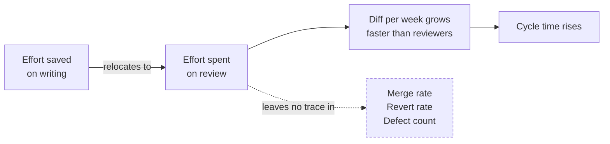

# Where the time actually goes

The promise is that typing gets cheaper. It does. The question here is what happens to
the hour you were going to save, and the answer, with reasonable consistency across everything
measured so far, is that it relocates rather than disappearing. Understanding where it lands is the
difference between a practice that captures the gain and one that files it under "we are definitely
faster" while the pull request queue quietly doubles.

## The only stopwatch anyone has held

One study has screen recordings. METR ran a randomised controlled trial in early 2025: 16
experienced open-source developers, 246 real tasks in repositories averaging over a million lines
and a decade of history, where the developers themselves averaged five years and some 1,500 commits
of prior work. Each task was randomly assigned to allow or disallow AI.

Allowing AI increased completion time by 19%, with a confidence interval of +2% to +39%.

That number is the most over-cited figure in the field and it needs its qualifiers attached
permanently. It measured Cursor Pro with Claude 3.5 and 3.7, February to June 2025, in mature
repositories with expert maintainers — two model generations ago. METR redesigned the study and
reported again in February 2026: −18% for the returning cohort (CI −38% to +9%) and −4% for newly
recruited developers (CI −15% to +9%), both straddling zero. Their own verdict on that data is that
it is "only very weak evidence" and "an unreliable signal of the current productivity effect of AI
tools".

The reason the follow-up could not settle it is the most interesting result of the whole exercise.
METR abandoned the design because "30% to 50% of developers told us that they were choosing not to
submit some tasks because they did not want to do them without AI". By 2026 the control arm had
become something people would not agree to do. Every hedge in this book traces back to that
sentence.

What survives all of the above is the time-allocation data, which is descriptive rather than causal
and does not depend on the headline. With AI allowed, developers spent less time writing code and
less time reading and searching, and more time prompting, waiting, and reviewing. Waiting accounted
for roughly 4% of time; reviewing and cleaning output, roughly 9% of issue completion time. Fewer
than 44% of generations were accepted. Every developer in the study modified the code they kept, 56%
reported often needing major cleanup to meet their own standards, and 75% read every line.

And the perception gap, which is the part worth carrying into your next estimate: the same
developers forecast a 24% speedup before starting and believed they had been sped up by 20%
afterwards. Economics and machine-learning experts asked to predict the result said 39% and 38%
faster. Everybody was wrong in the same direction, including the people holding the keyboard.

## At team scale, it turns into review

The largest study of a deliberate agentic push is a longitudinal panel of 802 developers and 196,212
pull requests at an AI-forward company that set an explicit doubling mandate, running January 2024
to April 2026. [*Know when not to use an
agent*](../part-2-plays/economics/know-when-not-to-use-an-agent.md) uses its headline result as a
closing argument. The interior of it is where the time accounting is.

Per-capita throughput reached 2.09× baseline. Within a given developer, holding the composition of
the team fixed, the gain was 1.46× to 1.72× depending on specification, rising to 1.99× after nine
months on the tool. The gap between those two figures is the difference between what the
organisation measured and what any individual experienced, and it is the number most likely to be
missing from whatever slide you were shown.

The gains were not evenly distributed either. Management tier gained 86%. Individual contributors
through Principal gained 27% to 42%, statistically indistinguishable from one another. Repositories
created in 2022 or later gained 44%. Legacy code gained 12%, and that result was not statistically
significant. DORA's 2026 ROI report relays a Stanford estimate with the same shape — 35–40% on
simple, greenfield work against 10% or less on complex legacy — though it prints no methodology
behind it.

Meanwhile, review changed character. Automated review rose from about 19% of pull requests to about
84% and overtook human review outright, and agent-authored pull requests spent about 20% longer
between first human review and merge than comparable human ones. Merge rates stayed essentially flat
and revert rates declined slightly, which is the detail that catches teams out: the quality signal
everyone watches is the one that does not move.

The authors' own summary is the sentence to carry, because it does the hedging for you: the result
is "evidence that a near-doubling is attainable under favorable conditions and over a long enough
horizon, not that it is typical, immediate, or free". Adoption was not randomised. Throughput here
is an activity count, and a parallel study at Microsoft notes in its own limitations that merged
pull requests "are an imperfect proxy for throughput and reward small, frequent PRs".

## The tax has a name

DORA's 2026 report models a J-curve: a temporary dip before value is captured, with three named
causes. One is the learning curve, one is pipeline adaptation, and one is the *verification tax* —
the time developers spend checking AI output. The effort saved on writing is respent on checking.
[*The four areas, re-weighted*](../part-1-argument/the-four-areas-reweighted.md) adopts that term,
and the [*Economics*](../part-2-plays/economics/index.md) and
[*Verification and trust*](../part-2-plays/verification-and-trust/index.md) suites use it. It is the
right frame precisely because it is not a bug tax. Across three independent studies the pattern
holds: output up, defect signals flat, review coverage down, cycle time up.

Two things follow for planning. The saving is real and lands on the person writing, while the cost
lands on the person reviewing, who is frequently somebody else and is not in the room when the
estimate is given. And review capacity, not model capability, is the resource a team runs out of
first. If you are choosing what to buy with the time an agent gives you, buying review is rarely the
exciting option and is usually the correct one.

## What has not been measured, and should stop being asserted

The honest accounting has to include the gaps, because they are where the confident claims come
from.

There is no randomised controlled trial of agentic coding. Every trial in the literature measures
autocomplete, inline completion, or chat; the genuinely agentic evidence is telemetry and
quasi-experiments, none of it randomised, and two of the three largest studies are authored by
people with an employer or commercial stake.

Nobody has cleanly measured total cost of ownership. Every study measures an activity — merged pull
requests, task completion time, commits — and the authors of the two largest say so in their own
papers. There is no published study following the full path from prompt to production incident.

And the biggest hole sits directly under this book's central recommendation: there is no controlled
study of what reviewers miss in agent-authored code. Nobody has seeded known defects into agent pull
requests and measured detection rate against human-authored ones. The automation-bias literature
that gets cited in its place comes from aviation and clinical decision support. Transferring it is a
reasonable argument, and it is an argument rather than a citation.

Nothing published measures whether a team with an explicit working agreement outperforms one
without, either. The [*Team*](../part-2-plays/team/index.md) suite is built on mechanisms that make
things checkable rather than on effect sizes, for exactly that reason.
