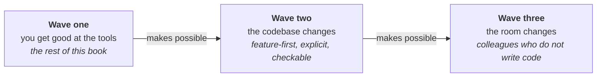

# The three waves

Forecasting in this field has a poor record and an enthusiastic press. The safe move for a book like
this one would be to stop where the sourced material stops and leave the future to people who enjoy
being quoted. This part is the unsafe move. It is kept short and it is labelled.

The rest of this book describes one situation: a developer, a codebase written for people, and a set
of tools to get good at. That is the first wave. It is where most teams are, it is where the
evidence is, and it is what the twenty plays are about. Two more waves look likely enough to be
worth preparing for, and they are the only material in this book that is not an account of something
already happening.

**The second wave changes the codebase.** The first wave takes the repository as it is and adapts
the way you work; the second asks what a repository would look like if agents were expected to work
in it, and then changes the repository. Layout, locality, explicitness, and the speed of the check
that says whether a change is wrong. This is a larger commitment than any single play asks for, and
it is the one with a real chance of being obsoleted by a model release.

**The third wave changes who is in the room.** A designer, a technical writer, or a support engineer
stops filing a request and starts making the change, with a developer as the person who built the
conditions rather than the person who does the typing. This one is further out, has less behind it,
and is the one most likely to arrive in a form nobody described in advance.

They are waves rather than stages because they overlap and because none of them finishes. A team can
be halfway into the second while still losing arguments that belong to the first, and the third
needs enough of the second to be in place that an outsider's change can be adjudicated by something
other than a developer reading it.

## How to discount this part

Four things are true of both
[*Refactoring a codebase for agents*](refactoring-a-codebase-for-agents.md) and
[*Inviting non-developers in*](inviting-non-developers-in.md), and stating them once here saves
repeating them.

- **Written September 2026.** Everything in the two chapters is a position at a date, and the
  argument for the second wave in particular is a bet about what models will still be bad at in a
  year.
- **Nothing here has a study behind it.** Everywhere else this book makes a claim about the world it
  cites one. These two chapters argue from mechanism instead: here is how the thing works, therefore
  here is what should follow. That is weaker evidence, and it is being called weaker evidence rather
  than dressed up.
- **Each chapter says what would change its mind.** A forecast with no falsifier is a mood. Both
  name the measurement that does not exist yet and would settle the question, and the signal worth
  watching in the meantime.
- **Each chapter ends on the part worth doing anyway** — the move that pays for itself whether or
  not the wave arrives. If you read one section per chapter, read that one.

The material underneath both is old enough to be reassuring. A codebase organised so that one
capability lives in one place, behaviour that is visible where it happens, and a check fast enough
to run on every change are all things somebody argued for before any of this existed. What is new is
that there is now a second reader, it has no memory between sessions, and it is extremely confident.
