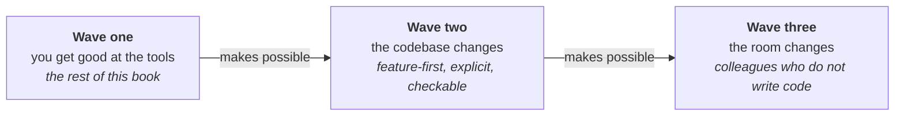

# The three waves

This part is a forecast, labelled as one, for readers who have the first wave in hand. The bet is
that two more waves follow the one the rest of this book describes: the second changes the codebase,
and the third changes who is in the room. Forecasting in this field has a poor record and an
enthusiastic press. The safe move would be to stop where the sourced material stops and leave the
future to people who enjoy being quoted. This part is the unsafe move, kept short.

The rest of this book describes one situation: a developer, a codebase written for people, and a set
of tools to get good at. That is the first wave. It is where most teams are, where the evidence is,
and what the twenty plays are about. The other two are the only material in this book that is not an
account of something already happening, and they are here because the world keeps moving.

**The second wave changes the codebase.** The first wave takes the repository as it is and adapts
the way you work. The second asks what a repository would look like if agents were expected to work
in it, and then changes the repository: layout, locality, explicitness, and the speed of the check
that says whether a change is wrong. This is a larger commitment than any single play asks for, and
a model release has a real chance of making it obsolete.

**The third wave changes who is in the room.** A designer, a technical writer, or a support engineer
stops filing a request and starts making the change. The developer becomes the person who built the
conditions, not the one who types. This wave is further out, has less behind it, and is the most
likely to arrive in a form nobody described in advance.

## Waves overlap, and ladders are not routes

They are waves, not stages, because they overlap and none of them finishes. A team can be halfway
into the second while still losing arguments that belong to the first. The third needs enough of the
second in place that something other than a developer reading it can adjudicate an outsider's
change.

A genre of staged adoption model circulates alongside this one, and it is worth reading for the
bottlenecks it names and worth discounting as a route. Each offers four or five numbered levels,
from a locked-down pilot to an organisation running agents in the hundreds. Each level grants a
little more trust and tooling than the last. There are two reasons to discount them. The levels
conflate how far an agent is trusted with how many are running, and those are independent: a team
can run ten agents under synchronous review, or one under none. And people who sell the rungs write
most of them, which makes a ladder a scoreboard kept by an interested party. This book makes the
same objection to a tool that reports its own savings ([*Starve the
context*](../part-2-plays/context/starve-the-context.md#failure-mode)). What would change the
reading is evidence that the order is forced, not described: teams that tried to skip a level and
could not. Until somebody follows a cohort through, a ladder is a taxonomy with an arrow drawn on
it. At every level the binding constraint is the one [*Where the time actually
goes*](../part-3-where-it-struggles/where-the-time-actually-goes.md) measures: somebody still has to
read the output.

## Both chapters are dated bets, argued from mechanism

Read [*Refactoring a codebase for agents*](refactoring-a-codebase-for-agents.md) and [*Inviting
non-developers in*](inviting-non-developers-in.md) with four things in mind.

- **Written September 2026.** Each chapter is a position at a date. The argument for the second wave
  in particular is a bet about what models will still be bad at in a year.
- **Nothing here has a study behind it.** Almost everywhere else, this book cites a study for each
  claim it makes about the world. These two chapters argue from mechanism instead: here is how the
  thing works, therefore here is what should follow. That is weaker evidence, and it is called that
  rather than dressed up.
- **Each chapter says what would change its mind.** A forecast with no falsifier is a mood. Both
  name the measurement that does not exist yet and would settle the question, and the signal worth
  watching in the meantime.
- **Each chapter ends on the part worth doing anyway:** the move that pays for itself whether or not
  the wave arrives. If you read one section per chapter, read *Do it on contact, whether or not the
  wave arrives* and *Build the four conditions for your own team first*.

The material underneath both is old enough to be reassuring. A codebase organised so that one
capability lives in one place, behaviour that is visible where it happens, and a check fast enough
to run on every change all had advocates before any of this existed. What is new is a second reader.
It has no memory between sessions, and its output always sounds certain.
